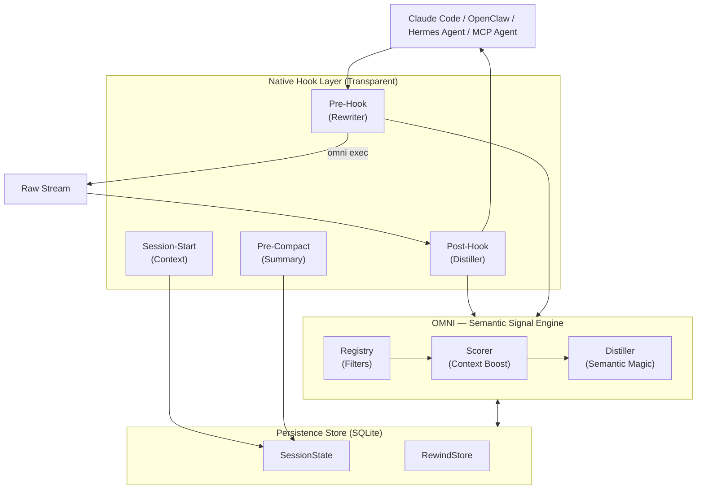

<div align="center">
  
  
  **Less noise. More signal. Cut your AI token consumption by up to 90%.**

  [](https://github.com/fajarhide/omni/actions/workflows/ci.yml)
  [](https://github.com/fajarhide/omni/releases)
  [](https://www.rust-lang.org/)
  [](https://modelcontextprotocol.io/)
  [](https://github.com/fajarhide/omni/blob/main/LICENSE)
  [](https://hits.sh/github.com/fajarhide/omni/)
</div>

<br/>

> **OMNI** is a smart terminal layer that intelligently filters and prioritizes command output before it reaches your AI agent. By preventing your AI from getting confused by noisy output, you get accurate answers faster while saving massive amounts of token costs.
> 
> *Fully transparent. You're always in control.*
---

## Table of Contents
- [The Problem: Expensive Tokens & Noisy Outputs](#the-problem-expensive-tokens--noisy-outputs)
- [The Solution: Omni](#the-solution-omni)
- [The Philosophy](#the-philosophy)
- [Features Explained](#features-explained)
- [Architecture](#architecture)
- [Quick Start & Installation](#quick-start--installation)
- [How to Use It](#how-to-use-it)
  - [Multi-Agent Support & Integrations](#multi-agent-support--integrations)
  - [Documentation Index](#documentation-index)
- [Works Even Better with Heimsense](#works-even-better-with-heimsense)
- [Contributing & License](#contributing--license)

---

## The Problem: Expensive Tokens & Noisy Outputs

When you use autonomous AI agents (like Claude Code) in your terminal, they read *everything*. A simple `git diff`, `npm install`, or `cargo test` command can easily dump 10,000 to 25,000 tokens of useless terminal noise into your AI's context. 

This causes three huge problems:
1. **It's extremely expensive**: You pay real money for every single token of that junk output.
2. **It makes the AI "dumb"**: Critical errors get buried under megabytes of warning logs and loading bars, confusing the AI and diluting its reasoning.
3. **Model Lock-in**: Advanced agent frameworks force you to use their most expensive flagship models just to have a context window big enough to handle all that noise.

## The Solution: Omni

I built Omni because I wanted to run AI agents efficiently and cheaply every single day in my own workflow. 

**Omni acts as the perfect filter between your terminal and your AI.** 

**The result?** You can run your AI agent on a super-advanced framework and feed it *zero noise*. Because the AI is only fed highly focused, straight-to-the-point context, even affordable or ordinary models will perform on-par with expensive flagship models, since they are never distracted by junk data.

My ultimate passion isn't to monetize this—it's to build the ultimate open-source toolbelt for the Agentic AI era. By aggressively saving token costs, I can develop software robustly and cost-effectively today, and you can too.

---

## The Philosophy

OMNI wasn't built just to "cut context" or "save tokens"—those are simply the happy side effects. The true philosophy behind OMNI is **Context Quality**.

AI agents like Claude are only as smart as the context you feed them. When you flood them with megabytes of dependency logs or loading bars, you force them to sift through garbage to find the actual problem. This dilutes their reasoning and leads to degraded or unhelpful responses.

**OMNI's goal is to feed your AI pure, highly-dense signal.** This means only grabbing the context that is actually important and meaningful for Claude. We clean up the noise the AI doesn't need, which means:
1. Automatically, the tokens you use are drastically fewer.
2. The AI's response is of **significantly higher quality** because its context window is laser-focused on the real problem.

**Try it for a week.** Feel the difference in the quality and speed of your AI's reasoning when it's fed on a diet of pure signal instead of raw terminal noise.

---

## Features Explained

- **No More AI Confusion**: Omni acts like a smart sieve. If a test fails, it shows the AI *only* the specific error line and stack trace. Your AI stops getting distracted by loading spinners or noisy dependency logs, allowing it to focus directly on the real problem.
- **90% Token Reduction**: By completely eliminating useless terminal noise, you drastically cut your agentic API bills instantly.
- **Zero Information Loss**: Worried Omni filtered something important? Don't be. Omni saves the raw output in a local archive (`RewindStore`). If the AI actually needs the full log, it can just automatically ask for it using `omni_retrieve`.
- **Session Intelligence**: Omni remembers what you are doing. It knows which files you are actively editing and stops feeding the AI context it already knows. Cross-session memory is now capable of preserving specific fixes permanently via `omni_knowledge`.
- **Multi-Agent Collaboration**: Omni is fully aware of its environment via `omni_agents`. If you have Cursor running alongside Claude CLI, they can seamlessly share the same filtered memory streams, active errors, and execution environments without clashing.
- **Distill Monitor**: Track your token savings and costs over time. Use `omni_budget` and `omni_history` right inside your LLM, or run `omni stats` locally to visualize your money saved.
- **Visual Impact (`omni diff`)**: See exactly how much money and space you are saving. Just run `omni diff` to see the bulky raw output compared side-by-side to Omni's sleek, filtered version.
- **Lightweight Dependency Graph**: OMNI builds a fast local file relationship graph at hook time (no daemon, no LSP). When your AI reads a heavily-imported file, OMNI warns it: `"this file has 12 dependents — call omni_context for full impact map."`.
- **Adaptive Compression**: OMNI tracks when agents retrieve omitted output. If a command family is frequently retrieved, OMNI automatically softens compression next time — self-tuning without configuration.
- **Structured ReadFile + Grep**: Instead of raw file dumps or flat grep output, OMNI returns structured outlines (imports, public API, risk markers) and grouped grep summaries (top files by match count, priority lines first).
- **Factual Anti-Hallucination Guards**: OMNI emits warnings only when it has hard facts — no speculation. If output is heavily compressed and no rewind exists: it says so. If a file has many dependents: it says so. Keeping your AI grounded in reality.

---
## Architecture



## Quick Start & Installation

Omni is incredibly easy to set up. It natively integrates into your terminal.

**macOS / Linux:**
```bash
# 1. Install via Homebrew
brew install fajarhide/tap/omni

# 2. Setup Omni (Interactive Menu for Claude, VS Code, OpenCode, Codex, Antigravity)
omni init

# 3. Verify it's working
omni doctor

# 4. Or auto-fix any issues
omni doctor --fix

# 5. Check Current Status
omni init --status
```

**Universal Installer (macOS / Linux / WSL):**
```bash 
curl -fsSL omni.weekndlabs.com/install | bash
```

**Windows (PowerShell):**
```powershell
irm omni.weekndlabs.com/install.ps1 | iex
```

---

## How to Use It

Once installed via `omni init`, OMNI works invisibly in the background. Whether your AI Agent runs a terminal command via MCP or you manually pipe output (`ls | omni`), OMNI automatically jumps in as a transparent layer. It intelligently filters terminal output, removes the noisy logs, and hands the clean signal back to the AI.

For detailed breakdown by savings, command, period, and route:
```bash
omni stats
```

To diagnose your OMNI installation (hooks, MCP, filters, database):
```bash
omni doctor
```

Need to see the filters in action or add your own custom rules?
You can easily create your own rules using simple TOML files in `~/.omni/filters/`.

### Multi-Agent Support & Integrations

By default, `omni init --claude` automatically hooks into **Claude Code**. However, OMNI works perfectly with any agentic AI through its built-in integrations! Run `omni init` to see the interactive menu.

1. **VS Code & Continue.dev**: Use our MCP context provider (`integrations/continue-dev/`).
2. **OpenCode & Codex CLI**: Built-in wrappers automatically pipe command output to OMNI.
3. **Antigravity IDE**: OMNI registers as a native MCP server in Antigravity's config (`~/.gemini/antigravity/mcp_config.json`). Run `omni init --antigravity` to set up automatically.

**Multi-Agent Tuning (`~/.omni/config.toml`)**
Different agents have different pain points. Keep VS Code chat clean, whilst letting OpenCode read more data. Tune them individually:
```toml
[global]
aggressiveness = "balanced"

[agents.vscode_continue]
aggressiveness = "aggressive"
enable_readfile_distillation = true

[agents.opencode]
aggressiveness = "conservative"
enable_readfile_distillation = false
```

### Documentation Index

**For Users:**
- [The Ultimate Guide (HOW_TO_USE.md)](docs/HOW_TO_USE.md) — Everything you need: Installation, `omni learn`, Custom TOML Filters, and CLI Commands.
- [OpenClaw Integration](https://clawhub.ai/fajarhide/omni-signal-engine) — Official OpenClaw plugin for native OMNI distillation. Install: `openclaw plugins install clawhub:@fajarhide/omni-signal-engine`
- [Hermes Agent Integration](https://github.com/wysie/hermes-omni-plugin) — Community Hermes Agent plugin for native OMNI distillation. Install: `uv pip install --python ~/.hermes/hermes-agent/venv/bin/python git+https://github.com/wysie/hermes-omni-plugin.git`

**For Developers & System Integrators:**
- [Development Guide](docs/DEVELOPMENT.md) — How to build and contribute to the OMNI codebase.
- [Testing Architecture](docs/TESTING.md) — Quality assurance and context safety.
- [Session Continuity](docs/SESSION.md) — Deep dive into OMNI's working memory.
- [Roadmap](docs/ROADMAP.md) — Current development status and upcoming features.
- [Migration Guide](docs/MIGRATION.md) — Notes on upgrading from Node/Zig to the Rust version.

---

## Works Even Better with Heimsense

Omni is part of my personal AI toolbelt. If you use `claude-code`, I highly recommend pairing Omni with my other project: **[Heimsense](https://github.com/fajarhide/heimsense)**. 

Heimsense unlocks restricted environments like `claude-code` to run with *any* free or OpenAI-compatible model, rather than forcing you to use expensive Anthropic ones. 
**Omni + Heimsense** = Run world-class agent frameworks using affordable models with zero noise and pinpoint accuracy.

---

## Contributing & License

This is a passion project built for the era of Agentic AI. Whether you're here to save money on tokens, test out free models, or help build the ultimate agentic toolbelt, contributions are always welcome!

- **Development**: Want to build from source? Run `make ci` and `cargo build`. Read our [CONTRIBUTING.md](CONTRIBUTING.md) for details.
- **License**: [MIT License](LICENSE)

<!-- Star History -->
<p align="center">
  <a href="https://star-history.com/#fajarhide/omni&Date">
    <picture>
      <source media="(prefers-color-scheme: dark)" srcset="https://api.star-history.com/svg?repos=fajarhide/omni&type=Date&theme=dark" />
      <source media="(prefers-color-scheme: light)" srcset="https://api.star-history.com/svg?repos=fajarhide/omni&type=Date" />
      
    </picture>
  </a>
</p>

Build with ❤️ by [Fajar Hidayat](https://github.com/fajarhide)