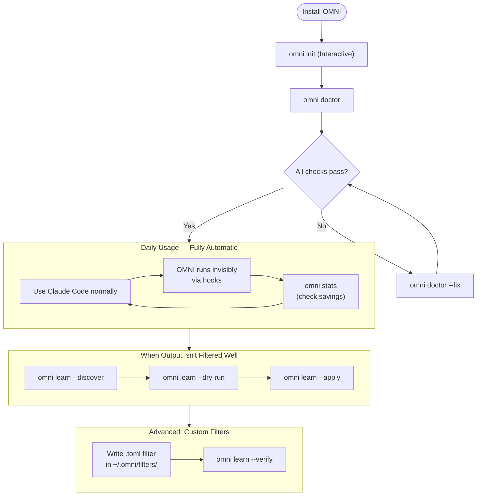

# OMNI — How to Use It

## What is OMNI?

When you use AI agents like **Claude Code**, the AI reads *everything* your terminal spits out. A single `cargo build` or `npm install` can dump **10,000–25,000 tokens** of useless loading bars and dependency logs directly into the AI's brain. You pay for every single one of those tokens — and the AI gets confused because the actual error is buried under all that junk.

**OMNI is a smart filter that sits between your terminal and your AI.**

It intercepts every command output, strips out the noise (progress bars, "Compiling..." lines, debug logs), and hands the AI only the pure signal — errors, warnings, test failures, and what actually matters.

```
Without OMNI:  AI sees 15,000 tokens of garbage → confused, expensive
With OMNI:     AI sees 800 tokens of pure signal → sharp, cheap
```

**The best part? After setup, you do absolutely nothing. It works invisibly.**

---

## How OMNI Works

```
┌─────────────────────────────────────────────────────────────────────────┐
│                         THE OMNI PIPELINE                               │
├─────────────────────────────────────────────────────────────────────────┤
│                                                                         │
│  Claude Code                                                            │
│  runs a command                                                         │
│       │                                                                 │
│       ▼                                                                 │
│  [Pre-Hook]  ──── OMNI rewrites command if needed                       │
│       │                                                                 │
│       ▼                                                                 │
│  Terminal runs the real command (cargo, git, npm, pytest...)            │
│       │                                                                 │
│       ▼                                                                 │
│  [Post-Hook] ──── OMNI intercepts the output                            │
│       │                                                                 │
│       ├── Registry: "This is a cargo build output"                      │
│       ├── Scorer: "These 3 lines are CRITICAL (errors)"                 │
│       │           "These 200 lines are NOISE (Compiling...)"            │
│       ├── Distill: Keep errors. Drop noise. Archive the rest.           │
│       │                                                                 │
│       ▼                                                                 │
│  Claude receives ONLY the clean signal (80-90% fewer tokens)            │
│                                                                         │
└─────────────────────────────────────────────────────────────────────────┘
```

Nothing to type. Nothing to configure per-session. Just use Claude Code normally.

---

## OMNI Workflow Overview



---

## 1. Installation

### Step 1 — Install the Binary

**macOS / Linux (Homebrew — Recommended):**
```bash
brew install fajarhide/tap/omni
```

**macOS / Linux / WSL (Script):**
```bash
curl -fsSL omni.weekndlabs.com/install | bash
```

**Windows (PowerShell):**
```powershell
irm omni.weekndlabs.com/install.ps1 | iex
```

**From Source:**
```bash
git clone https://github.com/fajarhide/omni.git
cd omni
cargo build --release
cp target/release/omni ~/.local/bin/
```

### Step 2 — Setup Hooks

This is the most important step. Without this, OMNI cannot intercept Claude Code's terminal output.

```bash
omni init
```

**What `omni init` does:**
- Installs the `PostToolUse` hook — intercepts every command output after it runs
- Installs the `SessionStart` hook — injects your working context at session start
- Installs the `PreCompact` hook — preserves context during Claude's memory compaction
- Registers OMNI as an MCP server — lets Claude call OMNI tools directly

### Step 3 — Verify

```bash
omni doctor
```

If anything is wrong, fix it automatically:
```bash
omni doctor --fix
```

### Step 4 — Done

Start Claude Code normally. OMNI is now active and invisible.

---


### Upgrading

```bash
# Homebrew
brew upgrade omni
omni init    # Reinstall hooks after upgrade

# Manual
curl -fsSL https://raw.githubusercontent.com/fajarhide/omni/main/scripts/install.sh | sh
omni init
```

See [MIGRATION.md](MIGRATION.md) for detailed upgrade instructions from 0.4.x.

### Uninstalling

```bash
# Homebrew
brew uninstall omni

# Manual
rm ~/.local/bin/omni
rm -rf ~/.omni/              # Remove config and database
omni init --uninstall        # Remove hooks (run before deleting binary)
```

## 2. What Happens Automatically (No Action Required)

Once installed, every command Claude runs goes through OMNI without you doing anything.

### Example: Before vs After

**`cargo test` without OMNI — Claude receives:**
```
   Compiling proc-macro2 v1.0.78
   Compiling quote v1.0.35
   Compiling unicode-ident v1.0.12
   Compiling syn v2.0.48
   ... (200 more Compiling lines)
   Compiling myapp v0.1.0
    Finished test profile in 12.34s
     Running tests/integration_test.rs
running 5 tests
test auth::test_login ... ok
test auth::test_logout ... ok
test auth::test_invalid_token ... FAILED

failures:

---- auth::test_invalid_token stdout ----
thread 'auth::test_invalid_token' panicked at 'assertion failed: `(left == right)`
  left: `401`,
 right: `403`', tests/auth_test.rs:45

test result: FAILED. 2 passed; 1 failed
```
**~3,000 tokens. Claude has to wade through 200+ noise lines to find the failure.**

---

**`cargo test` with OMNI — Claude receives:**
```
Tests: 2 passed, 1 failed

---- auth::test_invalid_token stdout ----
thread 'auth::test_invalid_token' panicked at 'assertion failed: `(left == right)`
  left: `401`,
 right: `403`', tests/auth_test.rs:45

test result: FAILED. 2 passed; 1 failed
```
**~150 tokens. Claude immediately sees what failed and why.**

---

### What OMNI Strips (Noise)

| Command | Stripped Lines |
|---|---|
| `cargo build` | All `Compiling ...` lines, `Downloading`, `Updating`, `Locking` |
| `npm install` | All `npm warn`, progress bars, version resolution logs |
| `pytest` | Platform info, `rootdir`, `collected N items`, all `PASSED` lines |
| `docker build` | Layer hashes, `Downloading`, `Extracting`, `Pull complete` |
| `git log` | Nothing — git output is mostly signal |
| `kubectl get pods` | Row noise, keeps status and errors |
| `terraform plan` | Verbose refresh output, keeps plan summary |

### What OMNI Always Keeps (Signal)

- ❌ Errors (compiler errors, stack traces, test failures)
- ⚠️ Warnings (unused imports, deprecations)
- ✅ Final results ("Finished", "Tests: 4 passed")
- 📝 File paths and line numbers (always preserved)
- 🔴 Anything with FAILED, ERROR, panic, exception

---

## 3. The RewindStore — Zero Information Loss

OMNI never permanently deletes output. When it archives content, it stores it with a unique hash in a local SQLite database (~/.omni/omni.db).

When OMNI drops a large chunk, it tells Claude:
```
[OMNI: 847 lines omitted — omni_retrieve("a3f8c2d1") for full output]
```

Claude can automatically call `omni_retrieve("a3f8c2d1")` via MCP to get the full content whenever it actually needs it. **This is fully automatic** — Claude handles this itself when needed.

To browse what's archived:
```bash
omni rewind list        # Show recent archived chunks
omni rewind a3f8c2d1   # View the full content of a specific archive
```

---

## 4. Checking Your Savings — `omni stats`

Run this any time to see how much OMNI has saved you.

```bash
omni stats              # Last 30 days (default)
omni stats --today      # Today only
omni stats --week       # Last 7 days
omni stats --month      # Last 30 days (explicit)
```

### Example Output

```
─────────────────────────────────────────────────
 OMNI Stats — last 30 days
─────────────────────────────────────────────────
 Commands processed:   1,247
 Input bytes:          48.3 MB
 Output bytes:         5.1 MB
 Signal ratio:         89.4% reduction
 Est. cost savings:    $0.43 / session

 By Filter:
   cargo      ████████████  847 calls  91% reduction
   npm        ████████      203 calls  84% reduction
   pytest     ██████        112 calls  79% reduction
   docker     █████          67 calls  73% reduction

 Route Distribution:
   Keep:        743 (59%)   ← clean distillation
   Soft:        312 (25%)   ← partial distillation
   Passthrough:  147 (12%)  ← unknown tool (sent to learning queue)
   Rewind:        45 (4%)   ← archived (too large)
─────────────────────────────────────────────────
```

**Passthrough** means OMNI didn't have a filter for that tool yet. Those get queued for learning (see Section 6).

### Custom Pricing Configuration
By default, OMNI estimates savings at **$0.43 / 100K tokens**. You can customize this in `~/.omni/config.toml`:

```toml
[pricing]
# Example: Claude 3.5 Sonnet pricing
input_price_per_1m = 3.0
output_price_per_1m = 15.0
```

---

## 5. Session Intelligence — OMNI Remembers What You're Working On

OMNI isn't just a static filter. It builds context about your current working session.

### What It Tracks

| What | How It's Used |
|---|---|
| **Hot Files** | Files you've been touching most (`src/auth/mod.rs`) |
| **Active Errors** | Unresolved errors from recent builds/tests |
| **Recent Commands** | Last 20 commands you've run |
| **Inferred Task** | What OMNI thinks you're doing ("fixing auth module") |
| **Domain** | Which directory/module you're focused on (`src/auth/`) |

### Why This Matters

When you've been debugging `src/auth/mod.rs` for an hour and then run `cargo build`, any output mentioning `auth` gets a **context boost** — it scores higher and is guaranteed to appear in the distilled output. OMNI dynamically increases the priority of information that's relevant to your current task.

### Checking Session State

```bash
omni session --status
```

Example output:
```
─────────────────────────────────────
 OMNI Session — active
─────────────────────────────────────
 ID:            a1b2c3d4-e5f6
 Started:       2 hours ago
 Last active:   10 minutes ago
 Task:          fixing auth module
 Domain:        src/auth/

 Context Boost:
   Hot files:   src/auth/mod.rs (12x), src/api/routes.rs (8x)
   Last cmds:   cargo test, git diff
   Errors:      error[E0432]: unresolved import

 Distillations: 47 total, 82% avg reduction
─────────────────────────────────────
```

### Session Commands

```bash
omni session --status      # What is OMNI tracking right now?
omni session --history     # List recent sessions
omni session --clear       # Start fresh (reset all context)
omni session --resume      # Resume an interrupted session
omni session --transcript  # View full log of current session
```

### Session TTL (How Long a Session Lives)

By default, a session stays alive for **4 hours** of inactivity. After that, OMNI starts a fresh one.

```bash
export OMNI_SESSION_TTL=480   # Extend to 8 hours (in minutes)
export OMNI_FRESH=1           # Force a brand-new session right now
export OMNI_CONTINUE=1        # Always continue the last session, regardless of TTL
```

---

## 6. Teaching OMNI New Filters — `omni learn`

OMNI can automatically generate TOML filters by analyzing repetitive noise in your terminal output. This is the fastest way to shrink your token usage without writing regex manually.

### How it works

The `omni learn` engine uses a "Word Prefix Frequency" algorithm:
1. It splits incoming text into lines.
2. It extracts the **first 3 words** of every line as a signature.
3. If a signature appears **3 or more times**, OMNI identifies it as a "Repetitive Noise Candidate".
4. It then generates a TOML filter that can either **Strip** (remove the line) or **Count** (replace with a summary count).

### 1. Passive Background Learning

Whenever OMNI runs as a hook (e.g., inside Claude Code), it silently monitors for patterns. If it finds noise that isn't already covered by a filter, it records it in a local queue:

`~/.omni/learn_queue.jsonl`

You can process this queue by discovering patterns first:
```bash
omni learn --discover
```

Then preview or apply:
```bash
omni learn --dry-run
```

### 2. Manual Learning (Pipe Mode)

If you have a log file or a command output that is very noisy, you can pipe it directly into OMNI to generate a filter:

```bash
cat build.log | omni learn --discover
```

### 3. Applying Learned Filters

Once you are happy with the dry-run output, apply it:

```bash
cat build.log | omni learn --apply
```

This will:
- Create (or append to) `~/.omni/filters/learned.toml`.
- Assign a unique ID to the filter (e.g., `learned_1711234567`).
- Include **inline tests** based on the actual log data to ensure the filter works as expected.

### Best Practices

- **Validate First**: Always use `--dry-run` before `--apply`.
- **Review `learned.toml`**: Since it's a standard TOML file, you can manually edit descriptions or refine regex patterns later.
- **Run Diagnostics**: After applying, run `omni doctor` to ensure the new filters are loaded correctly.
- **Verify Tests**: Run `omni learn --verify` to execute all inline tests in your filter library.

---
> [!TIP]
> OMNI Learn is designed to be conservative. It only suggests filters for patterns it is very confident in.

## 7. Writing Custom Filters

OMNI supports user-defined TOML filters for distilling output from any command — including internal company tools, custom deploy scripts, and CI pipelines.

| Directory | Priority | Description |
|---|---|---|
| **Built-in (embedded)** | Lowest | Compiled into the OMNI binary |
| **User** (`~/.omni/filters/`) | Medium | Personal/User-global filters |
| **Project** (`.omni/filters/`) | Highest | Project-specific (requires `omni trust`) |

### Hierarchy Logic
1. **Project-local filters** override User filters.
2. **User filters** override Built-in filters.
3. **Built-in filters** are the fallback for standard commands.

> [!NOTE]
> **Built-in** filters are not visible in the filesystem because they are compiled into the binary (`embedded`). If you want to modify them, create a file with the same name in `~/.omni/filters/` to override their behavior.

### Basic Structure

```toml
schema_version = 1

[filters.my_filter]
description = "What this filter does"
match_command = "^my-tool\\b"           # Regex matching command output
strip_ansi = true                       # Remove ANSI color codes first
confidence = 0.85                       # Base confidence score (0.0-1.0)

# Output matchers (first match wins)
[[filters.my_filter.match_output]]
pattern = "Deployment successful"       # Regex match on output
message = "deploy: ✓ success"           # Replacement message
unless = "ROLLBACK"                     # Skip if this pattern also appears

# Line filters
strip_lines_matching = ["^\\[DEBUG\\]", "^Waiting"]
keep_lines_matching  = []               # Mutually exclusive with strip

max_lines = 30                          # Maximum output lines
on_empty = "my_filter: completed"       # Fallback if everything is stripped

# Inline tests
[[tests.my_filter]]
name = "strips debug lines"
input = """
[DEBUG] Connecting...
Deployment successful
"""
expected = "deploy: ✓ success"
```

### Real-World Examples

### 1. Company Deploy Tool

```toml
schema_version = 1

[filters.deploy]
description = "Internal deploy pipeline"
match_command = "^deploy\\b"
strip_ansi = true
confidence = 0.90

[[filters.deploy.match_output]]
pattern = "Successfully deployed to (\\w+)"
message = "deploy: ✓ $1"

[[filters.deploy.match_output]]
pattern = "ROLLBACK"
message = "deploy: ✗ ROLLBACK triggered"

strip_lines_matching = [
    "^\\[DEBUG\\]",
    "^Uploading artifact",
    "^Waiting for health check",
    "^\\s*\\d+%",
]
max_lines = 20
on_empty = "deploy: completed (no notable output)"

[[tests.deploy]]
name = "success case"
input = """
[DEBUG] Connecting to prod-cluster
Uploading artifact...
  45%
  90%
  100%
Successfully deployed to production
Health check passed
"""
expected = "deploy: ✓ production"

[[tests.deploy]]
name = "rollback case"
input = """
[DEBUG] Deploying v2.0
Health check FAILED
ROLLBACK initiated
"""
expected = "deploy: ✗ ROLLBACK triggered"
```

### 2. Internal Test Runner

```toml
schema_version = 1

[filters.itest]
description = "Internal integration test runner"
match_command = "^itest\\b"
strip_ansi = true

[[filters.itest.match_output]]
pattern = "(\\d+) passed, (\\d+) failed"
message = "itest: $1 passed, $2 failed"

strip_lines_matching = [
    "^Setting up",
    "^Tearing down",
    "^\\s+PASS ",
    "^Loading fixtures",
]
keep_lines_matching = ["FAIL", "Error", "Timeout"]
max_lines = 25

[[tests.itest]]
name = "summarizes test run"
input = """
Setting up test environment...
Loading fixtures...
  PASS  test_user_create
  PASS  test_user_login
  FAIL  test_user_delete - Timeout after 30s
Tearing down...
3 passed, 1 failed
"""
expected = "itest: 3 passed, 1 failed"
```

### 3. Database Migration Tool

```toml
schema_version = 1

[filters.dbmigrate]
description = "Database migration runner"
match_command = "^db-migrate\\b"
strip_ansi = true
confidence = 0.80

[[filters.dbmigrate.match_output]]
pattern = "Applied (\\d+) migration"
message = "db: $1 migrations applied"

strip_lines_matching = [
    "^Checking connection",
    "^Reading migration files",
    "^\\s+OK ",
]
keep_lines_matching = ["ERROR", "ROLLBACK", "already applied"]
max_lines = 15

[[tests.dbmigrate]]
name = "normal migration"
input = """
Checking connection to postgres://db:5432
Reading migration files...
  OK  001_create_users.sql
  OK  002_add_email_index.sql
Applied 2 migrations
"""
expected = "db: 2 migrations applied"
```

### 4. CI Pipeline Status

```toml
schema_version = 1

[filters.ci]
description = "CI/CD pipeline output"
match_command = "^ci-status\\b"
strip_ansi = true

[[filters.ci.match_output]]
pattern = "Pipeline (\\w+): (\\w+)"
message = "ci: $1 → $2"

strip_lines_matching = [
    "^Fetching",
    "^Polling",
    "^\\s+Stage \\d+/\\d+",
]
keep_lines_matching = ["failed", "error", "timeout", "cancelled"]
max_lines = 10

[[tests.ci]]
name = "pipeline success"
input = """
Fetching pipeline status...
Polling...
  Stage 1/4: Build (done)
  Stage 2/4: Test (done)
  Stage 3/4: Deploy (done)
  Stage 4/4: Verify (done)
Pipeline main: success
"""
expected = "ci: main → success"
```

### 5. Log Aggregator Query

```toml
schema_version = 1

[filters.logquery]
description = "Log aggregator query results"
match_command = "^logq\\b"
strip_ansi = true

strip_lines_matching = [
    "^Querying",
    "^Scanning \\d+ shards",
    "^Results from",
]
keep_lines_matching = ["ERROR", "WARN", "FATAL", "panic", "OOM"]
max_lines = 40
on_empty = "logq: no errors found"

[[tests.logquery]]
name = "filters to errors only"
input = """
Querying prod logs (last 1h)...
Scanning 42 shards...
Results from us-east-1:
2024-01-15 10:30:01 INFO  Request processed
2024-01-15 10:30:02 INFO  Request processed
2024-01-15 10:30:03 ERROR Connection timeout to redis-primary
2024-01-15 10:30:04 INFO  Request processed
"""
expected = "2024-01-15 10:30:03 ERROR Connection timeout to redis-primary"
```

### Filter Fields Reference

| Field | Type | Required | Description |
|---|---|---|---|
| `description` | String | No | Human-readable description |
| `match_command` | Regex | No | Match against command text |
| `strip_ansi` | Bool | No | Remove ANSI codes before processing |
| `confidence` | Float | No | Base confidence score (0.0-1.0) |
| `strip_lines_matching` | \[Regex\] | No | Lines matching these patterns are removed |
| `keep_lines_matching` | \[Regex\] | No | Only keep lines matching these (exclusive with strip) |
| `max_lines` | Int | No | Maximum output lines |
| `on_empty` | String | No | Fallback output if everything stripped |

### Match Output Fields

| Field | Type | Description |
|---|---|---|
| `pattern` | Regex | Match against output content |
| `message` | String | Replacement message (supports `$1`, `$2` capture groups) |
| `unless` | Regex | Skip this match if unless-pattern also matches |

### Testing Your Filters

```bash
# Verify all loaded filters pass inline tests
omni learn --verify

# Discovery: search for patterns in a log file
omni learn --discover < output.log

# Preview: show generated TOML
omni learn --dry-run < output.log

# Action: apply patterns to learned.toml
omni learn --apply < output.log
```

### Project-local Filters (.omni/filters/)

This filter level is extremely useful for teams or repositories that have specific internal tooling. By placing filters inside the project folder, you ensure that the entire team (and their AI agents) gets consistent signal distillation.

### Usage Guide (Step-by-Step)

1. **Create Directory**: In your project root, create the `.omni/filters/` directory.
   ```bash
   mkdir -p .omni/filters
   ```

2. **Add Filter**: Create a TOML file, for example `.omni/filters/setup-backend.toml`.
   ```toml
   schema_version = 1
   [filters.setup-backend]
   match_command = "^./scripts/setup-db"
   strip_lines_matching = ["^Connecting", "^Checking versions"]
   on_empty = "db: setup complete"
   ```

3. **Verify & Trust**: Run `omni doctor`. You will see the status **[WARNING] NOT TRUSTED**. Run the following command to enable it:
   ```bash
   omni trust
   ```

### Benefits of Project Filters
- **Checked into Git**: These filters can be added to the repository (`git add .omni/filters`), ensuring anyone who clones the repo immediately gets the same token savings.
- **Custom Signalling**: Perfect for internal scripts that produce noisy output but only contain small bits of information relevant to the AI.

### Trust for Project Filters

Project-local filters (`.omni/filters/`) will not be loaded until you explicitly "trust" the project. This is a security feature to prevent malicious filters from untrusted repositories.

```bash
omni trust    # Review and approve filters in the current project
omni doctor   # Check trust status and number of loaded filters
```

## 8. Diagnostics — `omni doctor`

Your first move whenever something seems off.

```bash
omni doctor         # Check everything
omni doctor --fix   # Check AND auto-repair
```

### What It Checks

```
┌─────────────────────────────────────────────────────────────────────────┐
│                       omni doctor — CHECK LIST                          │
├─────────────────────────────────────────────────────────────────────────┤
│                                                                         │
│  Check                      │  What It Means                            │
│  ─────────────────────────────────────────────────────────────────────  │
│  Binary version             │  Is your OMNI up to date?                 │
│  Config dir (~/.omni/)      │  Is the data directory accessible?        │
│  SQLite database            │  Can OMNI read/write its database?        │
│  Claude Code hooks          │  Are all 3 hooks registered?              │
│  MCP server                 │  Is OMNI registered as an MCP tool?       │
│  Filter loading             │  Are all your TOML filters parsed OK?     │
│  RewindStore                │  Is the archive working?                  │
│  Intelligence               │  Are historical records up to date?       │
│                                                                         │
└─────────────────────────────────────────────────────────────────────────┘
```

### Auto-Fix Coverage

When you run `omni doctor --fix`, OMNI will automatically repair:

| Problem | Fix Applied |
|---|---|
| Missing `~/.omni/` directory | Creates it |
| Broken `.toml` filter files | Renames to `.toml.bak` |
| Historical `Unknown` stats records | Re-classifies with latest model |

The last one is worth calling out: if you've been using OMNI for a while, some old records might show `Unknown` in `omni stats` because the classifier didn't know the tool at the time. Running `omni doctor --fix` retroactively re-classifies them using the current, smarter model.

---

## 9. MCP Tools — Claude Can Ask OMNI Directly

When using Claude Code, OMNI also registers as an MCP server. This means Claude can call OMNI as a tool — not just passively receive filtered output, but actively query OMNI.

```
┌─────────────────────────────────────────────────────────────────────────┐
│                          OMNI MCP TOOLS                                 │
├─────────────────────────────────────────────────────────────────────────┤
│                                                                         │
│  Tool               │  What Claude Can Do With It                       │
│  ─────────────────────────────────────────────────────────────────────  │
│  omni_retrieve      │  Fetch content OMNI archived (RewindStore)        │
│  omni_learn         │  Ask OMNI to detect noise in a text snippet       │
│  omni_density       │  Analyze signal vs noise ratio of any text        │
│  omni_trust         │  Trust a project's local filter configs           │
│  omni_session       │  Check/clear/manage the session state             │
│                                                                         │
└─────────────────────────────────────────────────────────────────────────┘
```

**You don't need to call these manually.** Claude uses them automatically when needed — for example, when OMNI says `[OMNI: 847 lines omitted — omni_retrieve("a3f8c2d1")]`, Claude knows to call `omni_retrieve` to get the full content if it needs to investigate further.

---

## 10. Environment Variables

Fine-tune OMNI behavior without editing config files.

| Variable | Default | What It Does |
|---|---|---|
| `OMNI_SESSION_TTL` | `240` | Session timeout in minutes (4 hours) |
| `OMNI_FRESH` | unset | Set to `1` to force a fresh session immediately |
| `OMNI_CONTINUE` | unset | Set to `1` to always continue the last session |
| `OMNI_DB_PATH` | `~/.omni/omni.db` | Use a custom database location |
| `OMNI_QUIET` | unset | Set to `1` to suppress OMNI's own stderr output in pipe mode |

---

## 11. Command Reference

Complete reference for all OMNI commands and flags.

### Global Usage

```
omni [MODE] [COMMAND] [FLAGS]
```

### Modes (Automatic)

These are used by Claude Code hooks and MCP — you typically don't call them manually.

### `omni --hook`

Universal hook mode. Reads JSON from stdin with `hook_event_name` and dispatches to the appropriate handler.

```bash
# Called automatically by Claude Code
echo '{"hook_event_name": "PostToolUse", ...}' | omni --hook
```

> [!IMPORTANT]
> OMNI is designed for **Deliberate Action**. Core commands like `init`, `session`, and `learn` show help by default if no flags are provided. Always use a flag to perform an action or check status.

### `omni --mcp`

Start the MCP server. Provides 5 tools:

| Tool | Description |
|---|---|
| `omni_retrieve(hash)` | Retrieve content from RewindStore |
| `omni_learn(text, apply?)` | Detect noise patterns, suggest filters |
| `omni_density(text)` | Analyze token reduction ratio |
| `omni_trust(projectPath?)` | Trust a project's local config |
| `omni_compress(text)` | Compress text through the pipeline |

### Pipe Mode

```bash
# Explicit flags are recommended even in pipes for clarity
git diff HEAD~3 | omni --dry-run   # If learning
cargo test 2>&1 | omni             # standard distillation
```

---

### Commands

### `omni init`

Setup OMNI hooks in Claude Code.

```bash
omni init              # Interactive Menu for any AI Agent

# Or bypass the menu for a specific agent
omni init --claude     # Full Setup for Claude Code (Hooks + MCP)
omni init --cursor     # Setup for Cursor AI
omni init --zed        # Setup for Zed Editor
omni init --cline      # Setup for Cline
omni init --roo        # Setup for Roo Code
omni init --copilot    # Setup for GitHub Copilot CLI
omni init --gemini     # Setup for Gemini CLI
omni init --opencode   # Setup for OpenCode plugin
omni init --codex      # Setup for Codex CLI
omni init --openclaw   # Setup for OpenClaw plugin
omni init --antigravity# Setup for Antigravity IDE

# Claude-specific utilities
omni init --mcp        # Setup Claude MCP Server only
omni init --hook       # Setup Claude hooks only
omni init --status     # Check Claude installation status
omni init --uninstall  # Remove all OMNI components from Claude
```

**What it does:**
- Creates/updates `~/.claude/settings.json`
- Backs up existing settings to `settings.json.bak`
- Registers hook commands pointing to your `omni` binary

---

### `omni stats`

Token savings analytics dashboard.

```bash
omni stats              # Last 30 days (default)
omni stats --today      # Today only
omni stats --week       # Last 7 days
omni stats --month      # Last 30 days (explicit)
omni stats --passthrough  # Show commands without filter coverage
omni stats --session    # Session-level breakdown
```

**Output includes:**
- Commands processed, input/output bytes, signal ratio
- Estimated cost savings (@$3/1M tokens)
- Per-filter breakdown with ASCII bar charts
- Route distribution (Keep/Soft/Passthrough/Rewind)
- Session insights (hot files, accuracy signals)

---

### `omni session`

Inspect and manage session state.

```bash
omni session --status     # Show current session details (Hot files, etc.)
omni session --history    # List recent sessions
omni session --clear      # Clear current session
omni session --continue   # Continue a stale session
omni session --resume     # Resume an interrupted session
omni session --transcript # View transcript of recent session
```

---

### `omni learn`

Auto-generate TOML filters from passthrough output.

```bash
omni learn --discovery     # Discovery: Search for new noise patterns
omni learn --dry-run    # Preview: Show suggested TOML
omni learn --apply      # Action: Commit to learned.toml
omni learn --verify     # Test: Run inline tests on all filters
```

**How it works:**
1. Reads output text (stdin or learn queue)
2. Detects repetitive patterns (≥3 occurrences)
3. Generates TOML filter candidates
4. Optionally applies them to `learned.toml`

---

### `omni doctor`

Diagnose installation health.

```bash
omni doctor             # Run diagnostics only
omni doctor --fix       # Diagnose AND auto-fix all issues
```

**Checks:**
- Binary version
- Config directory (`~/.omni/`)
- SQLite database accessibility
- FTS5 support
- Claude Code hook installation
- MCP server registration
- Filter loading (built-in, user, project)
- RewindStore status
- Recent activity timestamps

**Auto-Fix (`--fix`):**

When `--fix` is passed, OMNI will automatically resolve detected issues:

| Issue | Fix Applied |
|---|---|
| Missing `~/.omni/` directory | Creates the directory |
| Untrusted project filters | Runs `omni trust` on the project |
| Invalid user filter files | Renames broken `.toml` to `.toml.bak` |

---

### `omni rewind`

View and manage archived content that was filtered out.

```bash
omni rewind list        # Show recent archived chunks
omni rewind <hash>      # View full content of a specific archive
```

---

### `omni diff`

Compare last original input vs distilled output to visually see what was removed.

```bash
omni diff
```

---

### `omni update`

Upgrade OMNI to the latest release and reinstall hooks (useful if not using Homebrew/package manager).

```bash
omni update
```

---

### `omni reset`

Clean uninstall and reset configurations (often used before backup restoration).

```bash
omni reset
```

---

### `omni version`

```bash
omni version    # Prints current version
```

---

### `omni help`

```bash
omni help       # Show usage information
omni --help     # Same as above
omni -h         # Same as above
```

---

### Environment Variables

| Variable | Default | Description |
|---|---|---|
| `OMNI_SESSION_TTL` | `240` | Session timeout in minutes |
| `OMNI_FRESH` | unset | Set to `1` to force a fresh session |
| `OMNI_CONTINUE` | unset | Set to `1` to always continue last session |
| `OMNI_DB_PATH` | `~/.omni/omni.db` | Custom database path |
| `OMNI_QUIET` | unset | Set to `1` to suppress stderr stats output in pipe mode |

### Exit Codes

| Code | Meaning |
|---|---|
| `0` | Success (includes empty stdin in pipe mode — silent passthrough) |
| `1` | Error (unknown command, database failure, etc.) |

Hooks **always** exit 0 — they never crash the host agent.

## 12. Troubleshooting

### Common Issues

| Issue | Likely Cause | Fix |
|---|---|---|
| OMNI not filtering anything | Not installed | Run `omni init` and select your agent |
| `omni stats` shows no data | First session not complete | Use Claude Code for a bit, then check |
| Filter not matching a command | `match_command` regex wrong | Test regex at regex101.com, then `omni learn --verify` |
| Session not persisting | DB not writable | Run `omni doctor`, check `~/.omni/` permissions |
| Context boost not working | Session too fresh | OMNI needs 3+ tool invocations to build context |
| `omni doctor --fix` fails | Binary not in PATH | Verify `which omni` returns a path |
| Stats showing many `Unknown` | Old records before classifier update | Run `omni doctor --fix` to re-classify |
| Broken filter after edit | TOML syntax error | Run `omni learn --verify` to find the broken filter |

### Getting Help

```bash
omni help          # General help
omni doctor        # Self-diagnostic
omni doctor --fix  # Self-repair
```

---

## 13. Checklist

### First-Time Setup
- [ ] Install OMNI (`brew install fajarhide/tap/omni` or script)
- [ ] Run `omni init` for your chosen agent
- [ ] Run `omni doctor` — all checks should be green
- [ ] If any checks fail, run `omni doctor --fix`
- [ ] Use Claude Code normally for one session
- [ ] Run `omni stats` to confirm savings are being tracked

### Weekly / Ongoing
- [ ] Run `omni stats` to review savings
- [ ] Run `omni learn --discovery` to check for new noise patterns to filter
- [ ] Run `omni learn --dry-run` if there are patterns
- [ ] Run `omni learn --apply` if the dry-run looks good
- [ ] Run `omni learn --verify` after applying any filters

### After Upgrading OMNI
- [ ] Run `omni doctor --fix` (re-classify historical data with new model)
- [ ] Run `omni stats` to confirm everything is working

### Before a Long Coding Session
- [ ] Check `omni session --status` (is there an existing session to continue?)
- [ ] If starting fresh: `omni session --clear`
- [ ] If continuing yesterday's work: `export OMNI_CONTINUE=1`

---

## 14. Multi-Agent & Cross-Session MCP Tools

OMNI exposes advanced diagnostic and state-management tools natively to AI Agents via the Model Context Protocol (MCP).

If you are using Claude Code, Cursor, or OpenClaw, the AI can independently call these tools without you typing anything. 

- `omni_history`: The AI can retrieve its own distillation footprint. It shows how many tokens were saved per process, enabling the agent to gauge whether it has saturated its query scope.
- `omni_budget`: A tool that allows the AI to estimate its token consumption vs threshold.
- `omni_agents`: Multi-agent awareness tool. If multiple agents are running in the same repo, this tool broadcasts the "Presence State", Active Errors, and Inferred Tasks, preventing conflicting edits.
- `omni_knowledge`: Allows an agent to commit project-specific rules, quirks, or learning variables permanently to the SQLite database. It loads dynamically during subsequent runtimes.
- `omni_session(action)`: The agent can inspect or flush its active Hot Files or trace pointers explicitly.

---

## 15. Best Practices

### For TOML Filters

**DO:**
- Always include at least one `[[tests.filter_name]]` block per filter
- Run `omni learn --verify` after writing or editing any filter
- Use `strip_ansi = true` for tools that output colored text
- Start with `--dry-run` before `--apply`

**DON'T:**
- Use overly broad `match_command` patterns — avoid matching unrelated tools
- Strip lines that might contain error messages (be conservative)
- Skip the inline tests — they protect you from accidentally breaking things

### For Sessions

**DO:**
- Let OMNI accumulate a few commands before expecting context boost to kick in
- Use `OMNI_CONTINUE=1` when resuming work on the same feature across days
- Check `omni session --status` when debugging — it shows exactly what context OMNI has

**DON'T:**
- Run `omni session --clear` mid-session unless you're switching to a completely unrelated task

### General

**DO:**
- Run `omni doctor` after any system update or Claude Code upgrade
- Check `omni stats --passthrough` to see which tools aren't being filtered yet (those are learning opportunities)
- Pair with [Heimsense](https://github.com/fajarhide/heimsense) if using non-Anthropic models

**DON'T:**
- Expect immediate savings on the very first command — OMNI improves over time as it learns your tools
- Worry about data loss — the RewindStore ensures nothing is permanently deleted

---

## 16. Integrations

OMNI is designed to be the "Intelligence Layer" for multiple agent frameworks.

### OpenClaw
You can use OMNI natively with OpenClaw by installing the official skill from ClawHub:
- **ClawHub**: [OMNI Semantic Signal Engine](https://clawhub.ai/fajarhide/omni-signal-engine)
- **Install Command**: `clawhub install omni-signal-engine`
- **Automatic Setup**: OpenClaw integration is completely automatic. Run `omni doctor --fix` to fetch and install the latest plugin directly from the OMNI public repository.

### Antigravity IDE

OMNI integrates with Antigravity IDE as a native MCP server, registered directly in Antigravity's MCP configuration file.

**Automatic Setup:**
```bash
omni init --antigravity
```

This registers OMNI as an MCP server at:
- **macOS/Linux**: `~/.gemini/antigravity/mcp_config.json`
- **Windows**: `%USERPROFILE%\.gemini\antigravity\mcp_config.json`

**Manual Setup:**

If you prefer to configure manually, add the `omni` entry to your `mcp_config.json`:

```json
{
  "mcpServers": {
    "omni": {
      "command": "/opt/homebrew/bin/omni",
      "args": ["--mcp"],
      "env": {
        "OMNI_AGENT_ID": "antigravity"
      }
    }
  }
}
```

> [!NOTE]
> Replace `/opt/homebrew/bin/omni` with the actual path to your OMNI binary. You can find it by running `which omni`.

**Verification:**
```bash
omni doctor    # Check Antigravity integration status
```

The doctor output will show:
```
  Antigravity IDE:
   Config:         ~/.gemini/antigravity/mcp_config.json [OK]
```

**Uninstall:**
```bash
omni reset --antigravity   # Remove OMNI from Antigravity MCP config
```

---

*This is a living document. OMNI is under active development — check the [CHANGELOG](https://github.com/fajarhide/omni/blob/main/CHANGELOG.md) for updates after each release.*