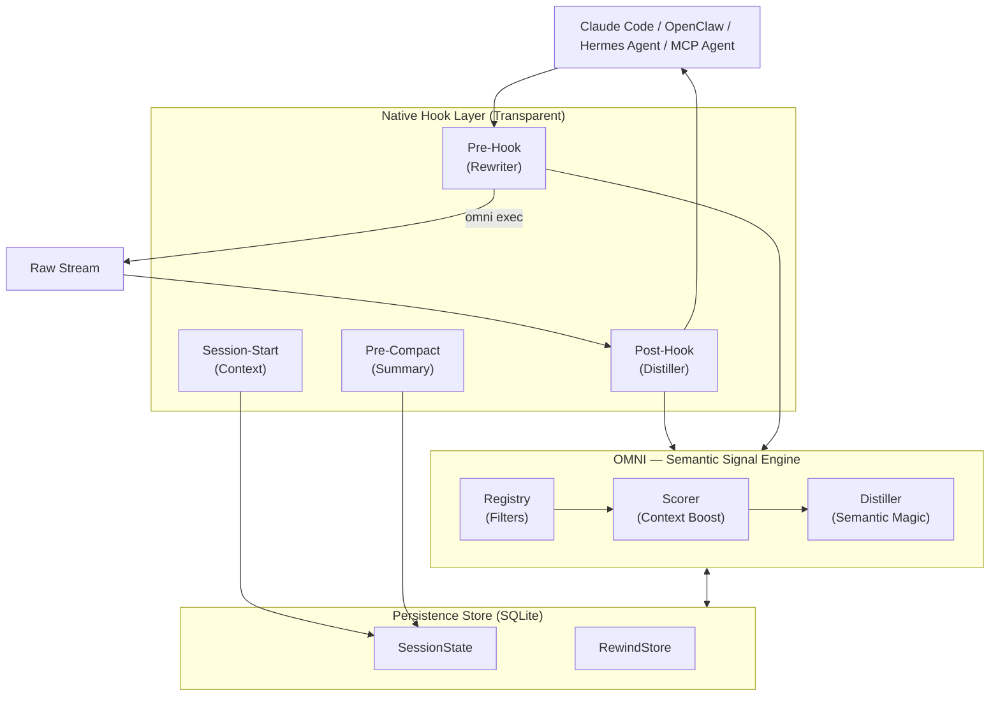

<div align="center" dir="rtl">
  
  
  **ضوضاء أقل. إشارات أكثر. قلل استهلاك رموز الذكاء الاصطناعي (Tokens) بنسبة تصل إلى 90%.**

  [🇺🇸 English](../README.md) | [🇯🇵 日本語](README-ja.md) | [🇨🇳 简体中文](README-zh.md) | [🇸🇦 العربية](README-ar.md) | [🇮🇩 Bahasa Indonesia](README-id.md) | [🇻🇳 Tiếng Việt](README-vi.md) | [🇰🇷 한국어](README-ko.md)

  [](https://github.com/fajarhide/omni/actions/workflows/ci.yml)
  [](https://github.com/fajarhide/omni/releases)
  [](https://www.rust-lang.org/)
  [](https://modelcontextprotocol.io/)
  [](https://github.com/fajarhide/omni/blob/main/LICENSE)
  [](https://hits.sh/github.com/fajarhide/omni/)
</div>

<br/>

<div dir="rtl">

> **OMNI** عبارة عن طبقة طرفية ذكية تقوم بتصفية مخرجات الأوامر وترتيب أولوياتها بذكاء قبل وصولها إلى وكيل الذكاء الاصطناعي الخاص بك. من خلال منع الذكاء الاصطناعي الخاص بك من الارتباك بسبب المخرجات الصاخبة، يمكنك الحصول على إجابات دقيقة بشكل أسرع مع توفير مبالغ هائلة من تكاليف الرموز.
> 
> *شفافية كاملة. أنت دائمًا في مركز التحكم.*
---

## جدول المحتويات
- [المشكلة: رموز باهظة الثمن ومخرجات صاخبة](#المشكلة-رموز-باهظة-الثمن-ومخرجات-صاخبة)
- [الحل: أومني (Omni)](#الحل-أومني-omni)
- [الفلسفة](#الفلسفة)
- [شرح الميزات](#شرح-الميزات)
- [الهيكلية](#الهيكلية)
- [البدء السريع والتثبيت](#البدء-السريع-والتثبيت)
- [كيفية الاستخدام](#كيفية-الاستخدام)
  - [دعم الوكلاء المتعددين والتكامل](#دعم-الوكلاء-المتعددين-والتكامل)
  - [فهرس الوثائق](#فهرس-الوثائق)
- [يعمل بشكل أفضل مع Heimsense](#يعمل-بشكل-أفضل-مع-heimsense)
- [المساهمة والترخيص](#المساهمة-والترخيص)

---

## المشكلة: رموز باهظة الثمن ومخرجات صاخبة

عندما تستخدم وكلاء الذكاء الاصطناعي المستقلين (مثل Claude Code) في جهازك الطرفي، فإنهم يقرؤون *كل شيء*. يمكن لأمر بسيط مثل `git diff` أو `npm install` أو `cargo test` بسهولة إلقاء 10000 إلى 25000 رمز من ضوضاء الجهاز الطرفي غير المجدية في سياق الذكاء الاصطناعي الخاص بك.

هذا يسبب ثلاث مشاكل ضخمة:
1. **باهظ التكلفة للغاية**: أنت تدفع أموالاً حقيقية مقابل كل رمز مميز من هذه المخرجات غير المرغوب فيها.
2. **يجعل الذكاء الاصطناعي "غبيًا"**: تُدفن الأخطاء الحرجة تحت ميغا بايت من سجلات التحذير وأشرطة التحميل، مما يربك الذكاء الاصطناعي ويضعف تفكيره.
3. **التقيد بالنماذج (Model Lock-in)**: تجبرك أطر الوكلاء المتقدمة على استخدام نماذجها الرئيسية الأكثر تكلفة فقط للحصول على نافذة سياق كبيرة بما يكفي للتعامل مع كل هذه الضوضاء.

## الحل: أومني (Omni)

لقد صممت أومني لأنني أردت تشغيل وكلاء الذكاء الاصطناعي بكفاءة وبتكلفة منخفضة كل يوم في سير عملي الخاص.

**يعمل أومني كمرشح مثالي بين جهازك الطرفي والذكاء الاصطناعي الخاص بك.**

**النتيجة؟** يمكنك تشغيل وكيل الذكاء الاصطناعي الخاص بك على إطار عمل متقدم للغاية وتغذيته *بصفر ضوضاء*. نظرًا لأنه يتم تزويد الذكاء الاصطناعي بسياق شديد التركيز ومباشر فقط، فحتى النماذج ذات الأسعار المعقولة أو العادية ستؤدي على قدم المساواة مع النماذج الرئيسية الباهظة الثمن، حيث لا تشتت انتباهها أبدًا البيانات غير المرغوب فيها.

شغفي المطلق ليس تحقيق الدخل من هذا، بل بناء حزام الأدوات مفتوح المصدر المطلق لعصر الذكاء الاصطناعي الوكيلي. من خلال توفير تكاليف الرموز بقوة، يمكنني تطوير برامج قوية وفعالة من حيث التكلفة اليوم، ويمكنك أنت أيضًا القيام بذلك.

---

## الفلسفة

لم يتم تصميم OMNI لمجرد "قطع السياق" أو "توفير الرموز" - فهذه ببساطة هي الآثار الجانبية السعيدة. الفلسفة الحقيقية وراء OMNI هي **جودة السياق**.

وكلاء الذكاء الاصطناعي مثل كلود أذكياء فقط بقدر السياق الذي تغذيهم به. عندما تغمرهم بالميغابايت من سجلات التبعية أو أشرطة التحميل، فإنك تجبرهم على غربلة القمامة للعثور على المشكلة الفعلية. هذا يخفف من تفكيرهم ويؤدي إلى استجابات متدهورة أو غير مفيدة.

**هدف OMNI هو تزويد الذكاء الاصطناعي الخاص بك بإشارة نقية وعالية الكثافة.** هذا يعني الحصول فقط على السياق المهم والجاد حقًا لكلود. نقوم بتنظيف الضوضاء التي لا يحتاجها الذكاء الاصطناعي، مما يعني:
1. تلقائيا، الرموز التي تستخدمها أقل بشكل كبير.
2. استجابة الذكاء الاصطناعي ذات **جودة أعلى بكثير** لأن نافذة سياقه تركز بالليزر على المشكلة الحقيقية.

**جربه لمدة أسبوع.** اشعر بالفرق في جودة وسرعة تفكير الذكاء الاصطناعي الخاص بك عندما يتم تغذيته بنظام غذائي من الإشارات النقية بدلاً من ضوضاء الجهاز الطرفي الخام.

---

## شرح الميزات

- **لا مزيد من ارتباك الذكاء الاصطناعي**: يعمل Omni كغربال ذكي. في حالة فشل الاختبار، فإنه يُظهر للذكاء الاصطناعي *فقط* سطر الخطأ المحدد وتتبع المكدس (stack trace). يتوقف الذكاء الاصطناعي الخاص بك عن تشتيت انتباهه بواسطة وحدات التحميل الدوارة أو سجلات التبعية الصاخبة، مما يسمح له بالتركيز مباشرة على المشكلة الحقيقية.
- **تخفيض الرموز بنسبة 90٪**: من خلال القضاء التام على ضوضاء الجهاز الطرفي غير المجدية، يمكنك خفض فواتير API الخاصة بالوكيل بشكل جذري على الفور.
- **صفر فقدان للمعلومات**: هل تشعر بالقلق من قيام أومني بتصفية شيء مهم؟ لا تكن كذلك. يحفظ Omni المخرجات الأولية في أرشيف محلي (`RewindStore`). إذا كان الذكاء الاصطناعي يحتاج بالفعل إلى السجل الكامل، فيمكنه فقط طلب ذلك تلقائيًا باستخدام `omni_retrieve`.
- **ذكاء الجلسة**: أومني يتذكر ما تفعله. وهو يعرف الملفات التي تقوم بتحريرها بنشاط ويتوقف عن إطعام الذكاء الاصطناعي السياق الذي يعرفه بالفعل. الذاكرة عبر الجلسات قادرة الآن على الحفاظ على إصلاحات محددة بشكل دائم عبر `omni_knowledge`.
- **التعاون متعدد الوكلاء**: يدرك Omni بيئته تمامًا عبر `omni_agents`. إذا كان لديك Cursor يعمل جنبًا إلى جنب مع Claude CLI، فيمكنهما مشاركة نفس تدفقات الذاكرة التي تمت تصفيتها والأخطاء النشطة وبيئات التنفيذ بسلاسة دون تعارض.
- **مراقب الاستخلاص**: تتبع مدخرات الرموز المميزة الخاصة بك وتكاليفها بمرور الوقت. استخدم `omni_budget` و `omni_history` مباشرة داخل LLM، أو قم بتشغيل `omni stats` محليًا لتصور أموالك المحفوظة.
- **التأثير البصري (`omni diff`)**: انظر بالضبط مقدار المال والمساحة التي توفرها. ما عليك سوى تشغيل `omni diff` لرؤية الإخراج الخام الضخم مقارنةً جنبًا إلى جنب بنسخة أومني الأنيقة والمفلترة.
- **رسم بياني للتبعية خفيف الوزن**: يبني OMNI رسمًا بيانيًا محليًا سريعًا لعلاقة الملفات في وقت الخطاف (بدون شيطان محلي (daemon)، وبدون LSP). عندما يقرأ الذكاء الاصطناعي ملفًا تم استيراده بكثافة، يحذره OMNI: `"هذا الملف يحتوي على 12 تابعًا - اتصل بـ omni_context للحصول على خريطة التأثير الكاملة."`.
- **ضغط متكيف**: يتتبع OMNI متى يقوم الوكلاء باسترداد المخرجات المحذوفة. إذا تم استرداد عائلة أوامر بشكل متكرر، يقوم OMNI تلقائيًا بتخفيف الضغط في المرة القادمة - ضبط ذاتي بدون تكوين.
- **التجاوز الذكي فائق السرعة**: لضمان زمن انتقال صفري للمهام الصغيرة، يقوم OMNI تلقائيًا بتجاوز عملية التقطير للمخرجات التي تقل عن عتبة 2000 توكن. وهذا يعطي الأولوية للسرعة مع الاستمرار في التقاط البيانات الكبيرة عندما يكون ذلك ضروريًا.
- **وضوح الحذف**: يقوم OMNI الآن بتمييز المحتوى المحذوف بوضوح (مثلاً، `[OMNI: omitted X lines of noise]`) في المخرجات، مما يمنح وكيل الذكاء الاصطناعي الخاص بك وعيًا أفضل بالموقف حول ما تم تصفيته.
- **تمرير تصحيح الأخطاء**: هل تحتاج إلى رؤية المخرجات الخام للحظة؟ ما عليك سوى تعيين `OMNI_PASSTHROUGH=1` في بيئتك لتجاوز المحرك تمامًا ورؤية كل حرف من المخرجات الأصلية.
- **ReadFile + Grep المهيكلة**: بدلاً من عمليات تفريغ الملفات الخام أو مخرجات grep المسطحة، يعيد OMNI مخططات مهيكلة (عمليات الاستيراد، وواجهة برمجة التطبيقات العامة، وعلامات المخاطر) وملخصات grep المجمعة (أعلى الملفات حسب عدد المطابقات، مع أولوية الأسطر أولاً).
- **حراس مكافحة الهلوسة الواقعية**: يصدر OMNI تحذيرات فقط عندما يكون لديه حقائق صلبة - لا تكهنات. إذا كانت المخرجات مضغوطة بشدة ولا يوجد تراجع: فإنه يقول ذلك. إذا كان الملف يحتوي على العديد من التابعين: فإنه يقول ذلك. الحفاظ على ذكائك الاصطناعي مرتكزًا على الواقع.

---
## الهيكلية



## البدء السريع والتثبيت

إعداد Omni سهل للغاية. يتم دمجه محليًا في محطتك الطرفية.

**macOS / Linux:**
```bash
# 1. التثبيت عبر Homebrew
brew install fajarhide/tap/omni

# 2. إعداد أومني (قائمة تفاعلية لـ Claude، VS Code، OpenCode، Codex، Antigravity)
omni init

# 3. تحقق من أنه يعمل
omni doctor

# 4. أو قم بإصلاح أي مشاكل تلقائيًا
omni doctor --fix

# 5. تحقق من الحالة الحالية
omni init --status
```

**مثبت عالمي (macOS / Linux / WSL):**
```bash 
curl -fsSL omni.weekndlabs.com/install | bash
```

**Windows (PowerShell):**
```powershell
irm omni.weekndlabs.com/install.ps1 | iex
```

---

## كيفية الاستخدام

بمجرد التثبيت عبر `omni init`، يعمل OMNI بشكل غير مرئي في الخلفية. سواء كان وكيل الذكاء الاصطناعي الخاص بك يدير أمرًا طرفيًا عبر MCP أو كنت تقوم بتوجيه الإخراج يدويًا (`ls | omni`)، يقفز OMNI تلقائيًا كطبقة شفافة. يقوم بتصفية الإخراج الطرفي بذكاء، ويزيل السجلات الصاخبة، ويسلم الإشارة النظيفة إلى الذكاء الاصطناعي.

للحصول على تفصيل مفصل حسب التوفير، والأمر، والفترة، والمسار:
```bash
omni stats
```

لتشخيص تثبيت OMNI الخاص بك (hooks، MCP، الفلاتر، قاعدة البيانات):
```bash
omni doctor
```

هل تحتاج إلى رؤية الفلاتر وهي تعمل أو إضافة القواعد المخصصة الخاصة بك؟
يمكنك بسهولة إنشاء القواعد الخاصة بك باستخدام ملفات TOML بسيطة في `~/.omni/filters/`.

### دعم الوكلاء المتعددين والتكامل

بشكل افتراضي، يتصل `omni init --claude` تلقائيًا بـ **Claude Code**. ومع ذلك، يعمل OMNI بشكل مثالي مع أي ذكاء اصطناعي وكيل من خلال عمليات التكامل المضمنة فيه! قم بتشغيل `omni init` لمشاهدة القائمة التفاعلية.

1. **VS Code و Continue.dev**: استخدم موفر سياق MCP الخاص بنا (`integrations/continue-dev/`).
2. **OpenCode و Codex CLI**: تقوم الأغلفة المضمنة تلقائيًا بتوجيه إخراج الأوامر إلى OMNI.
3. **Antigravity IDE**: يُسجل OMNI كخادم MCP محلي في تكوين Antigravity (`~/.gemini/antigravity/mcp_config.json`). قم بتشغيل `omni init --antigravity` للإعداد تلقائيًا.

**ضبط الوكلاء المتعددين (`~/.omni/config.toml`)**
الوكلاء المختلفون لديهم نقاط ألم مختلفة. حافظ على نظافة دردشة VS Code، مع السماح لـ OpenCode بقراءة المزيد من البيانات. اضبطها بشكل فردي:
```toml
[global]
aggressiveness = "balanced"

[agents.vscode_continue]
aggressiveness = "aggressive"
enable_readfile_distillation = true

[agents.opencode]
aggressiveness = "conservative"
enable_readfile_distillation = false
```

### فهرس الوثائق

**للمستخدمين:**
- [الدليل الشامل (HOW_TO_USE.md)](../docs/HOW_TO_USE.md) - كل ما تحتاجه: التثبيت، `omni learn`، مرشحات TOML المخصصة، وأوامر CLI.
- [تكامل OpenClaw](https://clawhub.ai/fajarhide/omni-signal-engine) - المكون الإضافي الرسمي لـ OpenClaw للتقطير الأصلي لـ OMNI. التثبيت: `openclaw plugins install clawhub:@fajarhide/omni-signal-engine`
- [تكامل Hermes Agent](https://github.com/wysie/hermes-omni-plugin) - المكون الإضافي لمجتمع Hermes Agent للتقطير الأصلي لـ OMNI. التثبيت: `uv pip install --python ~/.hermes/hermes-agent/venv/bin/python git+https://github.com/wysie/hermes-omni-plugin.git`

**للمطورين ومتكاملي الأنظمة:**
- [دليل التطوير](../docs/DEVELOPMENT.md) - كيفية بناء والمساهمة في قاعدة رموز OMNI.
- [هيكلية الاختبار](../docs/TESTING.md) - ضمان الجودة وسلامة السياق.
- [استمرارية الجلسة](../docs/SESSION.md) - تعمق في الذاكرة العاملة لـ OMNI.
- [خارطة الطريق](../docs/ROADMAP.md) - حالة التطوير الحالية والميزات القادمة.
- [دليل الترحيل](../docs/MIGRATION.md) - ملاحظات حول الترقية من إصدارات Node/Zig إلى إصدار Rust.

---

## يعمل بشكل أفضل مع Heimsense

يعد Omni جزءًا من حزام أدوات الذكاء الاصطناعي الشخصي الخاص بي. إذا كنت تستخدم `claude-code`، فإنني أوصي بشدة بإقران Omni مع مشروعي الآخر: **[Heimsense](https://github.com/fajarhide/heimsense)**.

يفتح Heimsense بيئات مقيدة مثل `claude-code` للتشغيل مع *أي* طراز مجاني أو متوافق مع OpenAI، بدلاً من إجبارك على استخدام نماذج Anthropic الباهظة الثمن.
**Omni + Heimsense** = تشغيل أطر الوكلاء ذات المستوى العالمي باستخدام نماذج ميسورة التكلفة مع عدم وجود ضوضاء ودقة متناهية.

---

## المساهمة والترخيص

هذا مشروع شغوف تم تصميمه لعصر الذكاء الاصطناعي الوكيلي. سواء كنت هنا لتوفير المال على الرموز المميزة، أو اختبار النماذج المجانية، أو المساعدة في بناء حزام أدوات الوكيل النهائي، نرحب دائمًا بالمساهمات!

- **التطوير**: هل تريد البناء من المصدر؟ قم بتشغيل `make ci` و `cargo build`. اقرأ [CONTRIBUTING.md](../CONTRIBUTING.md) الخاص بنا للحصول على التفاصيل.
- **الترخيص**: [MIT License](../LICENSE)

<!-- Star History -->
<p align="center">
  <a href="https://star-history.com/#fajarhide/omni&Date">
    <picture>
      <source media="(prefers-color-scheme: dark)" srcset="https://api.star-history.com/svg?repos=fajarhide/omni&type=Date&theme=dark" />
      <source media="(prefers-color-scheme: light)" srcset="https://api.star-history.com/svg?repos=fajarhide/omni&type=Date" />
      
    </picture>
  </a>
</p>

صُنع بـ ❤️ بواسطة [فجر هدايات](https://github.com/fajarhide)
</div>
