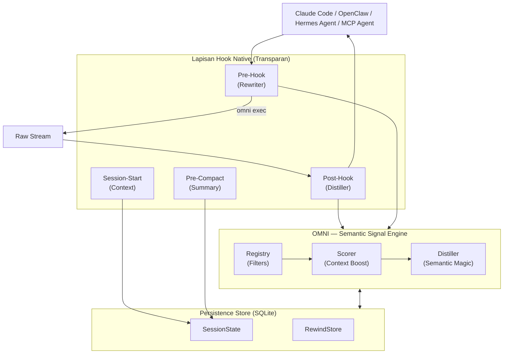

<div align="center">
  
  
  **Sedikit noise. Lebih banyak sinyal. Kurangi konsumsi token AI Anda hingga 90%.**

  [🇺🇸 English](../README.md) | [🇯🇵 日本語](README-ja.md) | [🇨🇳 简体中文](README-zh.md) | [🇸🇦 العربية](README-ar.md) | [🇮🇩 Bahasa Indonesia](README-id.md) | [🇻🇳 Tiếng Việt](README-vi.md) | [🇰🇷 한국어](README-ko.md)

  [](https://github.com/fajarhide/omni/actions/workflows/ci.yml)
  [](https://github.com/fajarhide/omni/releases)
  [](https://www.rust-lang.org/)
  [](https://modelcontextprotocol.io/)
  [](https://github.com/fajarhide/omni/blob/main/LICENSE)
  [](https://hits.sh/github.com/fajarhide/omni/)
</div>

<br/>

> **OMNI** adalah lapisan terminal pintar yang menyaring dan memprioritaskan output command secara cerdas sebelum mencapai agen AI Anda. Dengan mencegah AI Anda kebingungan oleh output yang bising, Anda mendapatkan jawaban akurat lebih cepat sekaligus menghemat biaya token secara besar-besaran.
> 
> *Sepenuhnya transparan. Anda selalu memegang kendali.*
---

## Daftar Isi
- [Masalah: Token Mahal & Output Bising](#masalah-token-mahal--output-bising)
- [Solusi: Omni](#solusi-omni)
- [Filosofi](#filosofi)
- [Penjelasan Fitur](#penjelasan-fitur)
- [Arsitektur](#arsitektur)
- [Mulai Cepat & Instalasi](#mulai-cepat--instalasi)
- [Cara Menggunakan](#cara-menggunakan)
  - [Dukungan Multi-Agen & Integrasi](#dukungan-multi-agen--integrasi)
  - [Indeks Dokumentasi](#indeks-dokumentasi)
- [Bekerja Lebih Baik dengan Heimsense](#bekerja-lebih-baik-dengan-heimsense)
- [Kontribusi & Lisensi](#kontribusi--lisensi)

---

## Masalah: Token Mahal & Output Bising

Ketika Anda menggunakan agen AI otonom (seperti Claude Code) di terminal Anda, mereka membaca *semuanya*. Command sederhana seperti `git diff`, `npm install`, atau `cargo test` dapat dengan mudah membuang 10.000 hingga 25.000 token dari kebisingan terminal yang tidak berguna ke dalam konteks AI Anda.

Hal ini menyebabkan tiga masalah besar:
1. **Sangat mahal**: Anda membayar dengan uang sungguhan untuk setiap token dari output sampah tersebut.
2. **Membuat AI menjadi "bodoh"**: Kesalahan kritis terkubur di bawah log peringatan dan loading bar berukuran megabyte, membingungkan AI dan mencairkan penalarannya.
3. **Penguncian Model**: Kerangka kerja agen canggih memaksa Anda menggunakan model unggulan mereka yang paling mahal hanya agar memiliki jendela konteks yang cukup besar untuk menangani semua kebisingan tersebut.

## Solusi: Omni

Saya membangun Omni karena saya ingin menjalankan agen AI secara efisien dan murah setiap hari dalam alur kerja saya sendiri.

**Omni bertindak sebagai filter sempurna antara terminal Anda dan AI Anda.**

**Hasilnya?** Anda dapat menjalankan agen AI Anda pada kerangka kerja yang sangat canggih dan memberinya *nol kebisingan*. Karena AI hanya diberi konteks yang sangat terfokus dan langsung pada intinya, bahkan model yang terjangkau atau biasa pun akan berkinerja setara dengan model unggulan yang mahal, karena mereka tidak pernah terganggu oleh data sampah.

Gairah utama saya bukanlah untuk memonetisasi ini—melainkan untuk membangun perangkat sumber terbuka pamungkas untuk era Agentic AI. Dengan menghemat biaya token secara agresif, saya dapat mengembangkan perangkat lunak secara tangguh dan hemat biaya hari ini, dan Anda juga bisa.

---

## Filosofi

OMNI tidak dibangun hanya untuk "memotong konteks" atau "menghemat token"—itu hanyalah efek samping yang membahagiakan. Filosofi sebenarnya di balik OMNI adalah **Kualitas Konteks**.

Agen AI seperti Claude hanya sepintar konteks yang Anda berikan kepada mereka. Ketika Anda membanjiri mereka dengan megabyte log dependensi atau loading bar, Anda memaksa mereka untuk memilah-milah sampah untuk menemukan masalah yang sebenarnya. Hal ini mencairkan penalaran mereka dan mengarah pada respons yang menurun kualitasnya atau tidak membantu.

**Tujuan OMNI adalah untuk memberi AI Anda sinyal murni yang sangat padat.** Ini berarti hanya mengambil konteks yang benar-benar penting dan bermakna bagi Claude. Kami membersihkan kebisingan yang tidak dibutuhkan AI, yang berarti:
1. Secara otomatis, token yang Anda gunakan secara drastis lebih sedikit.
2. Kualitas respons AI menjadi **jauh lebih tinggi** karena jendela konteksnya difokuskan pada masalah yang sebenarnya.

**Cobalah selama seminggu.** Rasakan perbedaan dalam kualitas dan kecepatan penalaran AI Anda saat diberi diet sinyal murni alih-alih kebisingan terminal mentah.

---

## Penjelasan Fitur

- **Tidak Ada Lagi Kebingungan AI**: Omni bertindak seperti saringan pintar. Jika tes gagal, ia menunjukkan kepada AI *hanya* garis kesalahan spesifik dan pelacakan tumpukan (stack trace). AI Anda berhenti terganggu oleh loading spinner atau log dependensi yang bising, memungkinkannya untuk fokus langsung pada masalah sebenarnya.
- **Pengurangan Token 90%**: Dengan menghilangkan sepenuhnya kebisingan terminal yang tidak berguna, Anda secara drastis memotong tagihan API agen Anda secara instan.
- **Nol Kehilangan Informasi**: Khawatir Omni memfilter sesuatu yang penting? Jangan khawatir. Omni menyimpan output mentah di arsip lokal (`RewindStore`). Jika AI benar-benar membutuhkan log lengkap, ia dapat memintanya secara otomatis menggunakan `omni_retrieve`.
- **Kecerdasan Sesi**: Omni mengingat apa yang sedang Anda lakukan. Ia tahu file mana yang sedang Anda edit secara aktif dan berhenti memberi AI konteks yang sudah ia ketahui. Memori lintas sesi kini mampu mempertahankan perbaikan spesifik secara permanen melalui `omni_knowledge`.
- **Kolaborasi Multi-Agen**: Omni sepenuhnya sadar akan lingkungannya melalui `omni_agents`. Jika Anda menjalankan Cursor di samping Claude CLI, mereka dapat berbagi aliran memori terfilter yang sama, kesalahan aktif, dan lingkungan eksekusi dengan lancar tanpa bentrok.
- **Monitor Distilasi**: Lacak penghematan token dan biaya Anda dari waktu ke waktu. Gunakan `omni_budget` dan `omni_history` langsung di dalam LLM Anda, atau jalankan `omni stats` secara lokal untuk memvisualisasikan uang yang Anda hemat.
- **Dampak Visual (`omni diff`)**: Lihat persis berapa banyak uang dan ruang yang Anda hemat. Cukup jalankan `omni diff` untuk melihat output mentah yang besar dibandingkan berdampingan dengan versi Omni yang ramping dan terfilter.
- **Grafik Dependensi Ringan**: OMNI membangun grafik hubungan file lokal yang cepat pada saat hook (tanpa daemon, tanpa LSP). Ketika AI Anda membaca file yang banyak diimpor, OMNI memperingatkannya: `"file ini memiliki 12 tanggungan — panggil omni_context untuk peta dampak penuh."`.
- **Kompresi Adaptif**: OMNI melacak kapan agen mengambil output yang dihilangkan. Jika sebuah keluarga command sering diambil, OMNI secara otomatis melembutkan kompresi pada waktu berikutnya — menyetel sendiri tanpa konfigurasi.
- **Smart High-Speed Bypass**: Untuk menjamin latensi nol pada tugas-tugas kecil, OMNI secara otomatis melewati proses distilasi untuk output di bawah ambang batas 2000 token. Ini memprioritaskan kecepatan sambil tetap menangkap data besar saat dibutuhkan.
- **Omission Visibility**: OMNI sekarang secara eksplisit memberi label pada konten yang dihapus (misalnya, `[OMNI: omitted X lines of noise]`) dalam output, memberikan agen AI Anda kesadaran situasional yang lebih baik tentang apa yang difilter.
- **Debug Passthrough**: Perlu melihat output mentah untuk sesaat? Cukup setel `OMNI_PASSTHROUGH=1` di lingkungan Anda untuk melewati mesin sepenuhnya dan melihat setiap karakter dari output asli.
- **ReadFile + Grep Terstruktur**: Alih-alih dump file mentah atau output grep datar, OMNI mengembalikan kerangka terstruktur (impor, API publik, penanda risiko) dan ringkasan grep yang dikelompokkan (file teratas berdasarkan jumlah kecocokan, baris prioritas terlebih dahulu).
- **Penjaga Anti-Halusinasi Faktual**: OMNI hanya mengeluarkan peringatan ketika memiliki fakta keras — bukan spekulasi. Jika output dikompresi berat dan tidak ada rewind yang ada: ia mengatakannya. Jika file memiliki banyak tanggungan: ia mengatakannya. Menjaga AI Anda tetap berpijak pada kenyataan.

---
## Arsitektur



## Mulai Cepat & Instalasi

Omni sangat mudah diatur. Ini terintegrasi secara native ke dalam terminal Anda.

**macOS / Linux:**
```bash
# 1. Instal via Homebrew
brew install fajarhide/tap/omni

# 2. Setup Omni (Menu Interaktif untuk Claude, VS Code, OpenCode, Codex, Antigravity)
omni init

# 3. Verifikasi instalasi berhasil
omni doctor

# 4. Atau perbaiki masalah secara otomatis
omni doctor --fix

# 5. Cek Status Saat Ini
omni init --status
```

**Universal Installer (macOS / Linux / WSL):**
```bash 
curl -fsSL omni.weekndlabs.com/install | bash
```

**Windows (PowerShell):**
```powershell
irm omni.weekndlabs.com/install.ps1 | iex
```

---

## Cara Menggunakan

Setelah diinstal melalui `omni init`, OMNI bekerja tanpa terlihat di latar belakang. Baik Agen AI Anda menjalankan perintah terminal melalui MCP atau Anda mem-pipe output secara manual (`ls | omni`), OMNI secara otomatis melompat masuk sebagai lapisan transparan. Ini secara cerdas menyaring output terminal, menghilangkan log yang bising, dan menyerahkan sinyal bersih kembali ke AI.

Untuk melihat rincian penghematan, perintah, periode, dan rute:
```bash
omni stats
```

Untuk mendiagnosis instalasi OMNI Anda (hook, MCP, filter, database):
```bash
omni doctor
```

Perlu melihat filter beraksi atau menambahkan aturan khusus Anda sendiri?
Anda dapat dengan mudah membuat aturan Anda sendiri menggunakan file TOML sederhana di `~/.omni/filters/`.

### Dukungan Multi-Agen & Integrasi

Secara default, `omni init --claude` secara otomatis masuk ke **Claude Code**. Namun, OMNI bekerja sempurna dengan AI agen apa pun melalui integrasi bawaannya! Jalankan `omni init` untuk melihat menu interaktif.

1. **VS Code & Continue.dev**: Gunakan penyedia konteks MCP kami (`integrations/continue-dev/`).
2. **OpenCode & Codex CLI**: Wrapper bawaan secara otomatis menyalurkan output perintah ke OMNI.
3. **Antigravity IDE**: OMNI mendaftar sebagai server MCP asli dalam konfigurasi Antigravity (`~/.gemini/antigravity/mcp_config.json`). Jalankan `omni init --antigravity` untuk mengatur secara otomatis.

**Penyetelan Multi-Agen (`~/.omni/config.toml`)**
Agen yang berbeda memiliki titik nyeri yang berbeda. Jaga agar obrolan VS Code tetap bersih, sambil membiarkan OpenCode membaca lebih banyak data. Setel secara individual:
```toml
[global]
aggressiveness = "balanced"

[agents.vscode_continue]
aggressiveness = "aggressive"
enable_readfile_distillation = true

[agents.opencode]
aggressiveness = "conservative"
enable_readfile_distillation = false
```

### Indeks Dokumentasi

**Untuk Pengguna:**
- [Panduan Utama (HOW_TO_USE.md)](../docs/HOW_TO_USE.md) — Segala yang Anda butuhkan: Instalasi, `omni learn`, Filter TOML Khusus, dan Perintah CLI.
- [Integrasi OpenClaw](https://clawhub.ai/fajarhide/omni-signal-engine) — Plugin OpenClaw resmi untuk distilasi OMNI native. Instal: `openclaw plugins install clawhub:@fajarhide/omni-signal-engine`
- [Integrasi Hermes Agent](https://github.com/wysie/hermes-omni-plugin) — Plugin Hermes Agent komunitas untuk distilasi OMNI native. Instal: `uv pip install --python ~/.hermes/hermes-agent/venv/bin/python git+https://github.com/wysie/hermes-omni-plugin.git`

**Untuk Developer & System Integrator:**
- [Panduan Pengembangan](../docs/DEVELOPMENT.md) — Cara membangun dan berkontribusi pada basis kode OMNI.
- [Arsitektur Pengujian](../docs/TESTING.md) — Jaminan kualitas dan keamanan konteks.
- [Keberlanjutan Sesi](../docs/SESSION.md) — Penyelaman mendalam ke dalam memori kerja OMNI.
- [Peta Jalan](../docs/ROADMAP.md) — Status pengembangan saat ini dan fitur yang akan datang.
- [Panduan Migrasi](../docs/MIGRATION.md) — Catatan tentang pemutakhiran dari versi Node/Zig ke versi Rust.

---

## Bekerja Lebih Baik dengan Heimsense

Omni adalah bagian dari sabuk alat AI pribadi saya. Jika Anda menggunakan `claude-code`, saya sangat menyarankan memasangkan Omni dengan proyek saya yang lain: **[Heimsense](https://github.com/fajarhide/heimsense)**.

Heimsense membuka kunci lingkungan terbatas seperti `claude-code` untuk berjalan dengan model gratis atau yang kompatibel dengan OpenAI *apa pun*, alih-alih memaksa Anda untuk menggunakan model Anthropic yang mahal.
**Omni + Heimsense** = Jalankan kerangka kerja agen kelas dunia menggunakan model yang terjangkau dengan nol kebisingan dan akurasi yang tepat sasaran.

---

## Kontribusi & Lisensi

Ini adalah proyek hasrat yang dibangun untuk era Agentic AI. Baik Anda di sini untuk menghemat uang pada token, menguji model gratis, atau membantu membangun sabuk alat agenik pamungkas, kontribusi selalu diterima!

- **Pengembangan**: Ingin membangun dari sumber? Jalankan `make ci` dan `cargo build`. Baca [CONTRIBUTING.md](../CONTRIBUTING.md) kami untuk detailnya.
- **Lisensi**: [MIT License](../LICENSE)

<!-- Star History -->
<p align="center">
  <a href="https://star-history.com/#fajarhide/omni&Date">
    <picture>
      <source media="(prefers-color-scheme: dark)" srcset="https://api.star-history.com/svg?repos=fajarhide/omni&type=Date&theme=dark" />
      <source media="(prefers-color-scheme: light)" srcset="https://api.star-history.com/svg?repos=fajarhide/omni&type=Date" />
      
    </picture>
  </a>
</p>

Dibuat dengan ❤️ oleh [Fajar Hidayat](https://github.com/fajarhide)
