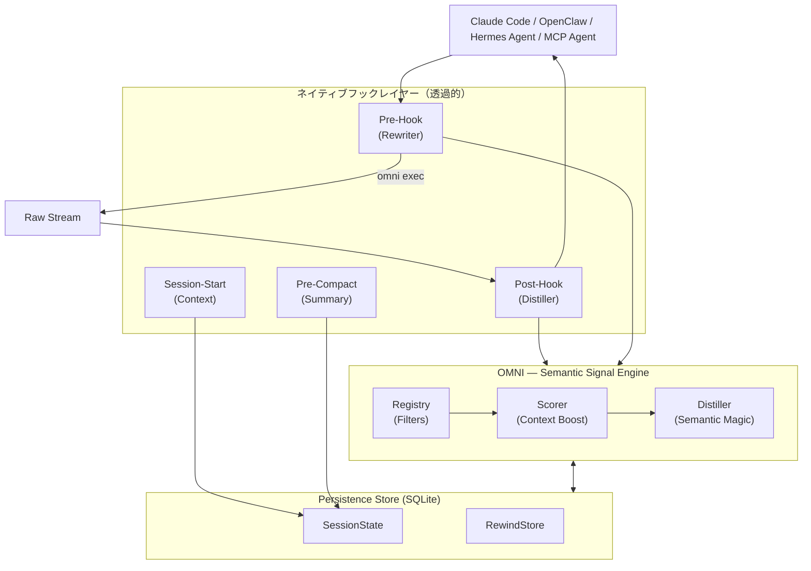

<div align="center">
  
  
  **ノイズを減らし、シグナルを増やす。AIのトークン消費を最大90%削減します。**

  [🇺🇸 English](../README.md) | [🇯🇵 日本語](README-ja.md) | [🇨🇳 简体中文](README-zh.md) | [🇸🇦 العربية](README-ar.md) | [🇮🇩 Bahasa Indonesia](README-id.md) | [🇻🇳 Tiếng Việt](README-vi.md) | [🇰🇷 한국어](README-ko.md)

  [](https://github.com/fajarhide/omni/actions/workflows/ci.yml)
  [](https://github.com/fajarhide/omni/releases)
  [](https://www.rust-lang.org/)
  [](https://modelcontextprotocol.io/)
  [](https://github.com/fajarhide/omni/blob/main/LICENSE)
  [](https://hits.sh/github.com/fajarhide/omni/)
</div>

<br/>

> **OMNI** は、コマンドの出力をAIエージェントに届く前にインテリジェントにフィルタリングし、優先順位を付けるスマートターミナルレイヤーです。ノイズの多い出力によってAIが混乱するのを防ぐことで、トークンコストを大幅に節約しながら、より正確な回答をより早く得ることができます。
> 
> *完全に透過的。常にコントロール下に。*
---

## 目次
- [問題：高価なトークンとノイズの多い出力](#問題高価なトークンとノイズの多い出力)
- [解決策：Omni](#解決策omni)
- [哲学](#哲学)
- [機能の解説](#機能の解説)
- [アーキテクチャ](#アーキテクチャ)
- [クイックスタートとインストール](#クイックスタートとインストール)
- [使い方](#使い方)
  - [マルチエージェントのサポートと統合](#マルチエージェントのサポートと統合)
  - [ドキュメントインデックス](#ドキュメントインデックス)
- [Heimsenseとの連携](#heimsenseとの連携)
- [貢献とライセンス](#貢献とライセンス)

---

## 問題：高価なトークンとノイズの多い出力

ターミナルで自律型AIエージェント（Claude Codeなど）を使用すると、それらは*すべて*を読み取ります。単純な `git diff`、`npm install`、または `cargo test` コマンドだけで、10,000から25,000トークンもの無駄なターミナルノイズがAIのコンテキストに簡単にダンプされます。

これにより、3つの大きな問題が発生します。
1. **非常に高価**：そのジャンク出力の1トークンごとにリアルマネーを支払うことになります。
2. **AIを「愚か」にする**：重要なエラーがメガバイト単位の警告ログやローディングバーの下に埋もれ、AIを混乱させ、その推論を希薄化させます。
3. **モデルのロックイン**：高度なエージェントフレームワークは、それらすべてのノイズを処理するのに十分な大きさのコンテキストウィンドウを持つためだけに、最も高価なフラッグシップモデルを使用することを強制します。

## 解決策：Omni

私は、自分自身のワークフローでAIエージェントを毎日効率的かつ安価に実行したかったため、Omniを構築しました。

**Omniは、ターミナルとAIの間の完璧なフィルターとして機能します。**

**その結果は？** 超高度なフレームワーク上でAIエージェントを実行し、*ゼロノイズ*を提供することができます。AIには非常に焦点を絞った要点のみのコンテキストのみが提供されるため、ジャンクデータに気を取られることがないため、手頃な価格のモデルや通常のモデルでも高価なフラッグシップモデルと同等のパフォーマンスを発揮します。

私の究極の情熱はこれを収益化することではなく、エージェント型AI時代のための究極のオープンソースツールベルトを構築することです。トークンコストを積極的に節約することで、私は今日堅牢かつ費用対効果の高いソフトウェアを開発することができ、あなたも同じことができます。

---

## 哲学

OMNIは、単に「コンテキストを削減する」または「トークンを節約する」ためだけに構築されたのではありません。これらは単なる副産物です。OMNIの背後にある真の哲学は**コンテキストの品質**です。

ClaudeのようなAIエージェントは、提供するコンテキストと同程度にしか賢くありません。メガバイト単位の依存関係ログやローディングバーで溢れさせると、実際の問題を見つけるためにガラクタをふるいにかけることを強制することになります。これは彼らの推論を希薄化させ、質の低下した、あるいは役に立たない応答につながります。

**OMNIの目標は、AIに純粋で非常に密度の高いシグナルを提供することです。** これは、Claudeにとって本当に重要で意味のあるコンテキストのみを取得することを意味します。AIが必要としないノイズをクリーンアップするため、次のようになります。
1. 自動的に、使用するトークンが劇的に少なくなります。
2. コンテキストウィンドウが真の問題にピンポイントで焦点を当てているため、AIの応答の**品質が大幅に向上**します。

**一週間試してみてください。** 生のターミナルノイズの代わりに純粋なシグナルの食事を与えられたときの、AIの推論の品質と速度の違いを感じてください。

---

## 機能の解説

- **AIの混乱はもうありません**：Omniはスマートなふるいのように機能します。テストが失敗した場合、特定のエラー行とスタックトレース*のみ*をAIに表示します。AIはノイズの多い依存関係ログやローディングスピナーに気を取られなくなり、実際の問題に直接集中できるようになります。
- **トークン90%削減**：無駄なターミナルノイズを完全に排除することで、エージェントAPIの請求額を即座に大幅に削減します。
- **情報損失ゼロ**：Omniが重要なものをフィルタリングしてしまったのではないかと心配ですか？ご心配なく。Omniは生の出力をローカルアーカイブ（`RewindStore`）に保存します。AIが実際に完全なログを必要とする場合は、`omni_retrieve`を使用して自動的に要求できます。
- **セッションインテリジェンス**：Omniはあなたが何をしているかを記憶しています。どのファイルをアクティブに編集しているかを認識し、すでに知っているコンテキストをAIに提供するのを停止します。クロスセッションメモリは、`omni_knowledge`を介して特定の修正を永続的に保持できるようになりました。
- **マルチエージェントコラボレーション**：Omniは`omni_agents`を介してその環境を完全に認識しています。Claude CLIと一緒にCursorを実行している場合、それらは衝突することなく、同じフィルタリングされたメモリストリーム、アクティブなエラー、および実行環境をシームレスに共有できます。
- **ディスティルモニター**：トークンの節約とコストを時間の経過とともに追跡します。LLMの内部で直接`omni_budget`と`omni_history`を使用するか、ローカルで`omni stats`を実行して節約したお金を視覚化します。
- **視覚的なインパクト (`omni diff`)**：どれだけのお金とスペースを節約しているかを正確に確認します。`omni diff`を実行するだけで、かさばる生の出力とOmniの洗練されたフィルター処理されたバージョンを並べて比較できます。
- **軽量な依存関係グラフ**：OMNIはフック時に高速なローカルファイル関係グラフを構築します（デーモンなし、LSPなし）。AIが頻繁にインポートされるファイルを読み取ると、OMNIは警告します。「このファイルには12の依存関係があります。完全な影響マップを表示するにはomni_contextを呼び出してください。」
- **適応型圧縮**：OMNIは、エージェントが省略された出力をいつ取得するかを追跡します。コマンドファミリーが頻繁に取得される場合、OMNIは次回自動的に圧縮を和らげます。設定なしで自己調整します。
- **スマート高速バイパス**: 小規模なタスクでゼロレイテンシを保証するため、OMNIは2000トークンのしきい値未満の出力に対して自動的にディスティレーションをバイパスします。これにより、重要なビッグデータをキャプチャしつつ、スピードを最優先します。
- **省略の可視化**: OMNIは出力内の削除されたコンテンツ（例：`[OMNI: omitted X lines of noise]`）を明示的にラベル付けするようになり、AIエージェントに何がフィルタリングされたかについてのより良い状況認識を提供します。
- **デバッグパススルー**: 生の出力を確認したいですか？環境変数に `OMNI_PASSTHROUGH=1` を設定するだけで、エンジンを完全にバイパスして元の出力のすべての文字を確認できます。
- **構造化ReadFile + Grep**：OMNIは、生のファイルダンプやフラットなgrep出力の代わりに、構造化されたアウトライン（インポート、パブリックAPI、リスクマーカー）とグループ化されたgrepの要約（一致数による上位ファイル、優先行を最初に表示）を返します。
- **事実に基づくハルシネーション防止ガード**：OMNIは、推測ではなく確固たる事実がある場合にのみ警告を発します。出力が大幅に圧縮されており、巻き戻しが存在しない場合は、そのように述べます。ファイルに多数の依存関係がある場合は、そのように述べます。AIを現実に根付かせておきます。

---
## アーキテクチャ



## クイックスタートとインストール

Omniのセットアップは信じられないほど簡単です。ターミナルにネイティブに統合されます。

**macOS / Linux:**
```bash
# 1. Homebrew経由でインストール
brew install fajarhide/tap/omni

# 2. Omniのセットアップ（Claude、VS Code、OpenCode、Codex、Antigravity用のインタラクティブメニュー）
omni init

# 3. 動作しているか確認
omni doctor

# 4. または問題を自動修正
omni doctor --fix

# 5. 現在のステータスを確認
omni init --status
```

**ユニバーサルインストーラー (macOS / Linux / WSL):**
```bash 
curl -fsSL omni.weekndlabs.com/install | bash
```

**Windows (PowerShell):**
```powershell
irm omni.weekndlabs.com/install.ps1 | iex
```

---

## 使い方

`omni init`でインストールされると、OMNIはバックグラウンドで目に見えずに機能します。AIエージェントがMCP経由でターミナルコマンドを実行する場合でも、手動で出力をパイプ処理（`ls | omni`）する場合でも、OMNIは自動的に透過的なレイヤーとして介入します。ターミナルの出力をインテリジェントにフィルタリングし、ノイズの多いログを削除して、クリーンなシグナルをAIに返します。

節約、コマンド、期間、およびルートごとの詳細な内訳を表示するには：
```bash
omni stats
```

OMNIのインストール（フック、MCP、フィルター、データベース）を診断するには：
```bash
omni doctor
```

フィルターの動作を確認したり、独自のカスタムルールを追加したりする必要がありますか？
`~/.omni/filters/` にあるシンプルなTOMLファイルを使用して、独自のルールを簡単に作成できます。

### マルチエージェントのサポートと統合

デフォルトでは、`omni init --claude` は自動的に **Claude Code** にフックします。ただし、OMNIは組み込みの統合を通じて、あらゆるエージェント型AIと完全に機能します！ `omni init`を実行してインタラクティブメニューを表示します。

1. **VS Code & Continue.dev**: MCPコンテキストプロバイダー（`integrations/continue-dev/`）を使用します。
2. **OpenCode & Codex CLI**: 組み込みのラッパーは、コマンドの出力を自動的にOMNIにパイプします。
3. **Antigravity IDE**: OMNIはAntigravityの構成（`~/.gemini/antigravity/mcp_config.json`）にネイティブMCPサーバーとして登録されます。`omni init --antigravity`を実行して自動的にセットアップします。

**マルチエージェントチューニング (`~/.omni/config.toml`)**
エージェントによって痛点（ペインポイント）は異なります。VS Codeのチャットをクリーンに保ちながら、OpenCodeにはより多くのデータを読み込ませることができます。個別に調整します：
```toml
[global]
aggressiveness = "balanced"

[agents.vscode_continue]
aggressiveness = "aggressive"
enable_readfile_distillation = true

[agents.opencode]
aggressiveness = "conservative"
enable_readfile_distillation = false
```

### ドキュメントインデックス

**ユーザー向け：**
- [アルティメットガイド (HOW_TO_USE.md)](../docs/HOW_TO_USE.md) — 必要なものすべて：インストール、`omni learn`、カスタムTOMLフィルター、およびCLIコマンド。
- [OpenClaw統合](https://clawhub.ai/fajarhide/omni-signal-engine) — ネイティブOMNIディスティレーション用の公式OpenClawプラグイン。インストール：`openclaw plugins install clawhub:@fajarhide/omni-signal-engine`
- [Hermes Agent統合](https://github.com/wysie/hermes-omni-plugin) — ネイティブOMNIディスティレーション用のコミュニティHermes Agentプラグイン。インストール：`uv pip install --python ~/.hermes/hermes-agent/venv/bin/python git+https://github.com/wysie/hermes-omni-plugin.git`

**開発者およびシステムインテグレーター向け：**
- [開発ガイド](../docs/DEVELOPMENT.md) — OMNIコードベースを構築して貢献する方法。
- [テストアーキテクチャ](../docs/TESTING.md) — 品質保証とコンテキストの安全性。
- [セッションの継続性](../docs/SESSION.md) — OMNIのワーキングメモリへのディープダイブ。
- [ロードマップ](../docs/ROADMAP.md) — 現在の開発ステータスと今後の機能。
- [移行ガイド](../docs/MIGRATION.md) — Node/ZigからRustバージョンへのアップグレードに関するメモ。

---

## Heimsenseとの連携

Omniは私の個人的なAIツールベルトの一部です。`claude-code`を使用している場合は、Omniを私の別のプロジェクトである**[Heimsense](https://github.com/fajarhide/heimsense)**とペアリングすることを強くお勧めします。

Heimsenseは、高価なAnthropicのモデルの使用を強制するのではなく、`claude-code`のような制限された環境のロックを解除して、*任意の*無料またはOpenAI互換モデルで実行できるようにします。
**Omni + Heimsense** = ゼロノイズとピンポイントの精度で、手頃な価格のモデルを使用して世界クラスのエージェントフレームワークを実行します。

---

## 貢献とライセンス

これは、エージェント型AIの時代のために構築された情熱的なプロジェクトです。トークンの費用を節約したい場合でも、無料モデルをテストしたい場合でも、究極のエージェント型ツールベルトの構築を手伝いたい場合でも、貢献はいつでも大歓迎です！

- **開発**：ソースからビルドしたいですか？ `make ci` と `cargo build` を実行してください。詳細については、[CONTRIBUTING.md](../CONTRIBUTING.md) をお読みください。
- **ライセンス**：[MIT License](../LICENSE)

<!-- Star History -->
<p align="center">
  <a href="https://star-history.com/#fajarhide/omni&Date">
    <picture>
      <source media="(prefers-color-scheme: dark)" srcset="https://api.star-history.com/svg?repos=fajarhide/omni&type=Date&theme=dark" />
      <source media="(prefers-color-scheme: light)" srcset="https://api.star-history.com/svg?repos=fajarhide/omni&type=Date" />
      
    </picture>
  </a>
</p>

[Fajar Hidayat](https://github.com/fajarhide) によって ❤️ を込めて構築されました
