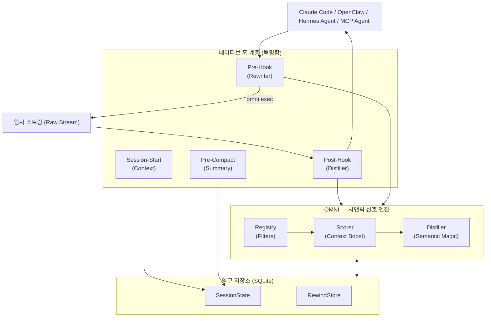

<div align="center">
  
  
  **노이즈는 줄이고, 신호는 늘리세요. AI 토큰 소비를 최대 90%까지 줄이십시오.**

  [🇺🇸 English](../README.md) | [🇯🇵 日本語](README-ja.md) | [🇨🇳 简体中文](README-zh.md) | [🇸🇦 العربية](README-ar.md) | [🇮🇩 Bahasa Indonesia](README-id.md) | [🇻🇳 Tiếng Việt](README-vi.md) | [🇰🇷 한국어](README-ko.md)

  [](https://github.com/fajarhide/omni/actions/workflows/ci.yml)
  [](https://github.com/fajarhide/omni/releases)
  [](https://www.rust-lang.org/)
  [](https://modelcontextprotocol.io/)
  [](https://github.com/fajarhide/omni/blob/main/LICENSE)
  [](https://hits.sh/github.com/fajarhide/omni/)
</div>

<br/>

> **OMNI**는 명령 출력이 AI 에이전트에 도달하기 전에 지능적으로 필터링하고 우선 순위를 지정하는 스마트 터미널 계층입니다. AI가 노이즈가 많은 출력으로 인해 혼란스러워하는 것을 방지함으로써 막대한 토큰 비용을 절약하는 동시에 정확한 답변을 더 빠르게 얻을 수 있습니다.
> 
> *완전히 투명합니다. 귀하가 항상 통제권을 가집니다.*
---

## 목차
- [문제점: 비싼 토큰과 노이즈가 많은 출력](#문제점-비싼-토큰과-노이즈가-많은-출력)
- [해결책: Omni](#해결책-omni)
- [철학](#철학)
- [기능 설명](#기능-설명)
- [아키텍처](#아키텍처)
- [빠른 시작 및 설치](#빠른-시작-및-설치)
- [사용 방법](#사용-방법)
  - [다중 에이전트 지원 및 통합](#다중-에이전트-지원-및-통합)
  - [문서 색인](#문서-색인)
- [Heimsense와 함께 사용하면 더욱 좋습니다](#heimsense와-함께-사용하면-더욱-좋습니다)
- [기여 및 라이센스](#기여-및-라이센스)

---

## 문제점: 비싼 토큰과 노이즈가 많은 출력

터미널에서 자율 AI 에이전트(예: Claude Code)를 사용할 때, 그들은 *모든 것*을 읽습니다. 단순한 `git diff`, `npm install` 또는 `cargo test` 명령은 AI의 컨텍스트에 10,000~25,000 토큰의 쓸모없는 터미널 노이즈를 쉽게 쏟아낼 수 있습니다.

이로 인해 세 가지 큰 문제가 발생합니다.
1. **극히 비쌉니다**: 당신은 그 쓸모없는 출력의 모든 단일 토큰에 대해 실제 돈을 지불합니다.
2. **AI를 "바보"로 만듭니다**: 중요한 오류는 메가바이트 단위의 경고 로그 및 로딩 막대 아래에 묻혀 AI를 혼란스럽게 하고 추론을 희석시킵니다.
3. **모델 종속 (Model Lock-in)**: 고급 에이전트 프레임워크는 이러한 모든 노이즈를 처리할 수 있을 만큼 큰 컨텍스트 창을 확보하기 위해 가장 비싼 플래그십 모델을 사용하도록 강요합니다.

## 해결책: Omni

저는 제 워크플로에서 매일 효율적이고 저렴하게 AI 에이전트를 실행하고 싶었기 때문에 Omni를 구축했습니다.

**Omni는 터미널과 AI 사이의 완벽한 필터 역할을 합니다.**

**결과는?** 초고도 프레임워크에서 AI 에이전트를 실행하고 *제로 노이즈*를 공급할 수 있습니다. AI에는 고도로 집중되고 핵심적인 컨텍스트만 제공되기 때문에, 정크 데이터에 의해 결코 산만해지지 않으므로 저렴하거나 평범한 모델도 비싼 플래그십 모델과 동등한 성능을 발휘합니다.

제 궁극적인 열정은 이를 수익화하는 것이 아닙니다. 에이전틱 AI 시대를 위한 궁극적인 오픈 소스 도구 벨트를 구축하는 것입니다. 토큰 비용을 적극적으로 절감함으로써 저는 오늘 강력하고 비용 효율적으로 소프트웨어를 개발할 수 있으며, 여러분도 마찬가지입니다.

---

## 철학

OMNI는 단지 "컨텍스트를 자르거나" "토큰을 절약하기 위해" 구축된 것이 아닙니다. 그것들은 단순히 행복한 부작용일 뿐입니다. OMNI 이면의 진정한 철학은 **컨텍스트 품질**입니다.

Claude와 같은 AI 에이전트는 제공하는 컨텍스트만큼만 영리합니다. 메가바이트 단위의 종속성 로그나 로딩 막대로 넘쳐나게 하면, 실제 문제를 찾기 위해 쓰레기 더미를 뒤지도록 강요하는 것입니다. 이는 추론을 희석시키고 저하되거나 도움이 되지 않는 응답으로 이어집니다.

**OMNI의 목표는 AI에 순수하고 밀도가 높은 신호를 제공하는 것입니다.** 즉, Claude에게 실제로 중요하고 의미 있는 컨텍스트만 가져오는 것을 의미합니다. 우리는 AI에 필요하지 않은 노이즈를 정리하며, 이는 다음을 의미합니다.
1. 자동으로, 사용하는 토큰이 대폭 줄어듭니다.
2. 컨텍스트 창이 실제 문제에 레이저처럼 초점을 맞추고 있기 때문에 AI 응답의 **품질이 현저히 높아집니다**.

**일주일 동안 사용해 보세요.** AI가 원시 터미널 노이즈 대신 순수한 신호로 가득 찬 식단을 섭취할 때의 추론 품질과 속도의 차이를 느껴보세요.

---

## 기능 설명

- **더 이상의 AI 혼란은 없습니다**: Omni는 스마트 체처럼 작동합니다. 테스트가 실패하면 AI에 특정 오류 줄과 스택 추적*만* 표시합니다. 귀하의 AI는 로딩 스피너나 노이즈가 많은 종속성 로그에 더 이상 방해받지 않으므로 실제 문제에 직접 집중할 수 있습니다.
- **90% 토큰 감소**: 쓸모없는 터미널 노이즈를 완전히 제거하여 에이전트 API 청구서를 즉시 대폭 줄입니다.
- **정보 손실 없음**: Omni가 중요한 것을 필터링했을까 봐 걱정되십니까? 걱정하지 마세요. Omni는 원시 출력을 로컬 아카이브(`RewindStore`)에 저장합니다. AI가 실제로 전체 로그를 필요로 하는 경우 `omni_retrieve`를 사용하여 자동으로 요청할 수 있습니다.
- **세션 인텔리전스**: Omni는 당신이 무엇을 하고 있는지 기억합니다. 어떤 파일을 적극적으로 편집하고 있는지 알고 있으며, AI에게 이미 알고 있는 컨텍스트를 제공하는 것을 중지합니다. 이제 `omni_knowledge`를 통해 교차 세션 메모리가 특정 픽스를 영구적으로 유지할 수 있습니다.
- **다중 에이전트 협업**: Omni는 `omni_agents`를 통해 환경을 완전히 인식합니다. Claude CLI와 함께 Cursor를 실행하는 경우, 충돌 없이 필터링된 동일한 메모리 스트림, 활성 오류 및 실행 환경을 원활하게 공유할 수 있습니다.
- **증류 모니터 (Distill Monitor)**: 시간에 따른 토큰 절약 및 비용을 추적합니다. LLM 내부에서 직접 `omni_budget` 및 `omni_history`를 사용하거나 로컬에서 `omni stats`를 실행하여 절약된 금액을 시각화하십시오.
- **시각적 영향 (`omni diff`)**: 비용과 공간을 얼마나 절약하고 있는지 정확히 확인하세요. 부피가 큰 원시 출력과 세련되고 필터링된 Omni의 버전을 나란히 비교하려면 `omni diff`를 실행하기만 하면 됩니다.
- **경량 종속성 그래프**: OMNI는 훅 시간에 빠른 로컬 파일 관계 그래프를 구축합니다(데몬 없음, LSP 없음). AI가 많이 가져온(imported) 파일을 읽을 때 OMNI는 경고합니다. `"이 파일에는 12개의 종속성이 있습니다 — 전체 영향 맵을 보려면 omni_context를 호출하세요."`
- **적응형 압축**: OMNI는 에이전트가 생략된 출력을 언제 검색하는지 추적합니다. 명령군이 자주 검색되면 OMNI는 다음에 자동으로 압축을 완화합니다. 구성 없이 스스로 조정합니다.
- **지능형 고속 바이패스**: 소규모 작업에 대해 제로 지연 시간을 보장하기 위해, OMNI는 2000토큰 임계값 미만의 출력에 대해 자동으로 증류를 바이패스합니다. 이는 속도를 우선시하면서도 중요한 대용량 데이터는 필요할 때 캡처합니다.
- **생략 가시성**: OMNI는 이제 출력에서 제거된 콘텐츠(예: `[OMNI: omitted X lines of noise]`)를 명시적으로 표시하여 AI 에이전트가 무엇이 필터링되었는지 더 잘 인지할 수 있도록 합니다.
- **디버그 패스스루**: 잠시 동안 원본 출력을 확인해야 하나요? 환경에서 `OMNI_PASSTHROUGH=1`을 설정하기만 하면 엔진을 완전히 바이패스하고 원본 출력의 모든 문자를 확인할 수 있습니다.
- **구조화된 ReadFile + Grep**: 원시 파일 덤프 또는 평면적인 grep 출력 대신, OMNI는 구조화된 개요(import, 공개 API, 위험 마커)와 그룹화된 grep 요약(일치 횟수별 최상위 파일, 우선 순위 줄 먼저)을 반환합니다.
- **사실적 환각 방지 가드 (Factual Anti-Hallucination Guards)**: OMNI는 명확한 사실이 있을 때만 경고를 보냅니다. 추측은 없습니다. 출력이 크게 압축되어 있고 되감기(rewind)가 없는 경우: 그렇다고 말합니다. 파일에 많은 종속성이 있는 경우: 그렇다고 말합니다. AI가 현실에 기반을 두도록 유지합니다.

---
## 아키텍처



## 빠른 시작 및 설치

Omni는 설정하기가 매우 쉽습니다. 터미널에 기본적으로 통합됩니다.

**macOS / Linux:**
```bash
# 1. Homebrew를 통한 설치
brew install fajarhide/tap/omni

# 2. Omni 설정 (Claude, VS Code, OpenCode, Codex, Antigravity를 위한 대화형 메뉴)
omni init

# 3. 제대로 작동하는지 확인
omni doctor

# 4. 또는 문제를 자동으로 수정
omni doctor --fix

# 5. 현재 상태 확인
omni init --status
```

**유니버설 설치 프로그램 (macOS / Linux / WSL):**
```bash 
curl -fsSL omni.weekndlabs.com/install | bash
```

**Windows (PowerShell):**
```powershell
irm omni.weekndlabs.com/install.ps1 | iex
```

---

## 사용 방법

`omni init`를 통해 설치되면 OMNI는 백그라운드에서 눈에 띄지 않게 작동합니다. AI 에이전트가 MCP를 통해 터미널 명령을 실행하든, 수동으로 출력을 파이프(`ls | omni`)하든, OMNI는 자동으로 투명한 계층으로 뛰어듭니다. 터미널 출력을 지능적으로 필터링하고 노이즈가 많은 로그를 제거하여 깨끗한 신호를 AI에 다시 전달합니다.

절감액, 명령, 기간 및 경로별 자세한 분석 정보:
```bash
omni stats
```

OMNI 설치 상태(훅, MCP, 필터, 데이터베이스)를 진단하려면:
```bash
omni doctor
```

필터가 작동하는 것을 보거나 사용자 지정 규칙을 추가해야 합니까?
`~/.omni/filters/`의 간단한 TOML 파일을 사용하여 고유한 규칙을 쉽게 만들 수 있습니다.

### 다중 에이전트 지원 및 통합

기본적으로 `omni init --claude`는 자동으로 **Claude Code**에 훅(hook)됩니다. 그러나 OMNI는 내장된 통합을 통해 모든 에이전틱 AI와 완벽하게 작동합니다! `omni init`를 실행하여 대화형 메뉴를 봅니다.

1. **VS Code & Continue.dev**: 당사의 MCP 컨텍스트 공급자(`integrations/continue-dev/`)를 사용합니다.
2. **OpenCode & Codex CLI**: 내장 래퍼(wrapper)가 명령 출력을 OMNI로 자동 파이프합니다.
3. **Antigravity IDE**: OMNI는 Antigravity의 구성(`~/.gemini/antigravity/mcp_config.json`)에 기본 MCP 서버로 등록됩니다. `omni init --antigravity`를 실행하여 자동으로 설정합니다.

**다중 에이전트 튜닝 (`~/.omni/config.toml`)**
에이전트마다 문제점(pain points)이 다릅니다. VS Code 채팅을 깨끗하게 유지하면서 OpenCode가 더 많은 데이터를 읽을 수 있도록 허용하세요. 개별적으로 조정합니다:
```toml
[global]
aggressiveness = "balanced"

[agents.vscode_continue]
aggressiveness = "aggressive"
enable_readfile_distillation = true

[agents.opencode]
aggressiveness = "conservative"
enable_readfile_distillation = false
```

### 문서 색인

**사용자용:**
- [최고의 가이드 (HOW_TO_USE.md)](../docs/HOW_TO_USE.md) — 필요한 모든 것: 설치, `omni learn`, 사용자 정의 TOML 필터 및 CLI 명령.
- [OpenClaw 통합](https://clawhub.ai/fajarhide/omni-signal-engine) — 기본 OMNI 정제를 위한 공식 OpenClaw 플러그인. 설치: `openclaw plugins install clawhub:@fajarhide/omni-signal-engine`
- [Hermes 에이전트 통합](https://github.com/wysie/hermes-omni-plugin) — 기본 OMNI 정제를 위한 커뮤니티 Hermes 에이전트 플러그인. 설치: `uv pip install --python ~/.hermes/hermes-agent/venv/bin/python git+https://github.com/wysie/hermes-omni-plugin.git`

**개발자 및 시스템 통합자용:**
- [개발 가이드](../docs/DEVELOPMENT.md) — OMNI 코드베이스 구축 및 기여 방법.
- [테스트 아키텍처](../docs/TESTING.md) — 품질 보증 및 컨텍스트 안전.
- [세션 연속성](../docs/SESSION.md) — OMNI의 작업 기억 장치에 대한 심층 분석.
- [로드맵](../docs/ROADMAP.md) — 현재 개발 상태 및 향후 기능.
- [마이그레이션 가이드](../docs/MIGRATION.md) — Node/Zig에서 Rust 버전으로 업그레이드하는 것에 대한 참고 사항.

---

## Heimsense와 함께 사용하면 더욱 좋습니다

Omni는 제 개인 AI 도구 벨트의 일부입니다. `claude-code`를 사용하는 경우, Omni를 제 다른 프로젝트인 **[Heimsense](https://github.com/fajarhide/heimsense)**와 함께 사용하는 것을 적극 권장합니다.

Heimsense는 값비싼 Anthropic 모델을 사용하도록 강요하는 대신, `claude-code`와 같은 제한된 환경의 잠금을 해제하여 무료 또는 OpenAI 호환 모델을 사용하여 실행할 수 있도록 합니다.
**Omni + Heimsense** = 노이즈 제로 및 핀포인트 정확도로 저렴한 모델을 사용하여 세계적 수준의 에이전트 프레임워크를 실행하십시오.

---

## 기여 및 라이센스

이것은 에이전틱 AI 시대를 위해 구축된 열정적인 프로젝트입니다. 토큰 비용을 절약하거나, 무료 모델을 테스트하거나, 궁극의 에이전틱 도구 벨트를 구축하는 것을 돕고자 여기에 오신 모든 분들의 기여를 언제나 환영합니다!

- **개발**: 소스에서 빌드하고 싶으신가요? `make ci` 및 `cargo build`를 실행하십시오. 자세한 내용은 [CONTRIBUTING.md](../CONTRIBUTING.md)를 참조하십시오.
- **라이센스**: [MIT 라이센스](../LICENSE)

<!-- Star History -->
<p align="center">
  <a href="https://star-history.com/#fajarhide/omni&Date">
    <picture>
      <source media="(prefers-color-scheme: dark)" srcset="https://api.star-history.com/svg?repos=fajarhide/omni&type=Date&theme=dark" />
      <source media="(prefers-color-scheme: light)" srcset="https://api.star-history.com/svg?repos=fajarhide/omni&type=Date" />
      
    </picture>
  </a>
</p>

[Fajar Hidayat](https://github.com/fajarhide)이(가) ❤️로 구축함
