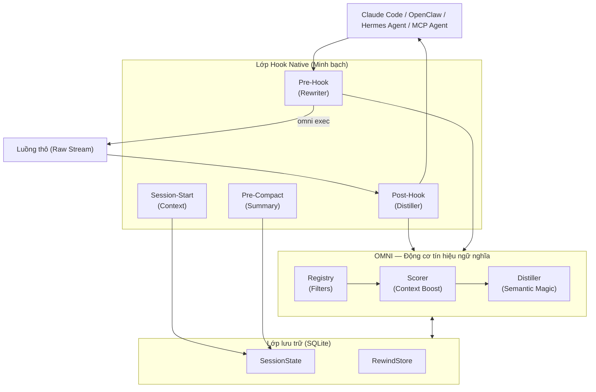

<div align="center">
  
  
  **Ít nhiễu hơn. Nhiều tín hiệu hơn. Cắt giảm lượng token AI tiêu thụ của bạn lên đến 90%.**

  [🇺🇸 English](../README.md) | [🇯🇵 日本語](README-ja.md) | [🇨🇳 简体中文](README-zh.md) | [🇸🇦 العربية](README-ar.md) | [🇮🇩 Bahasa Indonesia](README-id.md) | [🇻🇳 Tiếng Việt](README-vi.md) | [🇰🇷 한국어](README-ko.md)

  [](https://github.com/fajarhide/omni/actions/workflows/ci.yml)
  [](https://github.com/fajarhide/omni/releases)
  [](https://www.rust-lang.org/)
  [](https://modelcontextprotocol.io/)
  [](https://github.com/fajarhide/omni/blob/main/LICENSE)
  [](https://hits.sh/github.com/fajarhide/omni/)
</div>

<br/>

> **OMNI** là một lớp thiết bị đầu cuối thông minh giúp lọc và ưu tiên đầu ra lệnh một cách thông minh trước khi nó tiếp cận tác nhân AI của bạn. Bằng cách ngăn AI của bạn bối rối trước những đầu ra ồn ào, bạn có thể nhận được các câu trả lời chính xác nhanh hơn đồng thời tiết kiệm được một lượng lớn chi phí token.
> 
> *Hoàn toàn minh bạch. Bạn luôn là người kiểm soát.*
---

## Mục lục
- [Vấn đề: Token đắt đỏ & Đầu ra nhiễu loạn](#vấn-đề-token-đắt-đỏ--đầu-ra-nhiễu-loạn)
- [Giải pháp: Omni](#giải-pháp-omni)
- [Triết lý](#triết-lý)
- [Giải thích các tính năng](#giải-thích-các-tính-năng)
- [Kiến trúc](#kiến-trúc)
- [Bắt đầu nhanh & Cài đặt](#bắt-đầu-nhanh--cài-đặt)
- [Cách sử dụng](#cách-sử-dụng)
  - [Hỗ trợ đa tác nhân & Tích hợp](#hỗ-trợ-đa-tác-nhân--tích-hợp)
  - [Mục lục tài liệu](#mục-lục-tài-liệu)
- [Hoạt động tuyệt vời hơn với Heimsense](#hoạt-động-tuyệt-vời-hơn-với-heimsense)
- [Đóng góp & Giấy phép](#đóng-góp--giấy-phép)

---

## Vấn đề: Token đắt đỏ & Đầu ra nhiễu loạn

Khi bạn sử dụng các tác nhân AI tự chủ (như Claude Code) trong thiết bị đầu cuối của mình, chúng sẽ đọc *tất cả mọi thứ*. Một lệnh `git diff`, `npm install` hoặc `cargo test` đơn giản có thể dễ dàng ném 10.000 đến 25.000 token dữ liệu rác vào ngữ cảnh của AI của bạn.

Điều này gây ra ba vấn đề lớn:
1. **Cực kỳ tốn kém**: Bạn phải trả tiền thật cho từng token của những đầu ra rác rưởi đó.
2. **Làm cho AI trở nên "ngốc nghếch"**: Các lỗi nghiêm trọng bị chôn vùi dưới hàng megabyte nhật ký cảnh báo và thanh tải, làm bối rối AI và làm suy giảm khả năng lập luận của nó.
3. **Khóa chặt mô hình (Model Lock-in)**: Các framework tác nhân tiên tiến buộc bạn phải sử dụng những mô hình hàng đầu đắt tiền nhất của họ chỉ để có đủ một cửa sổ ngữ cảnh lớn để xử lý tất cả những tiếng ồn đó.

## Giải pháp: Omni

Tôi xây dựng Omni vì tôi muốn chạy các tác nhân AI một cách hiệu quả và rẻ tiền mỗi ngày trong luồng công việc của riêng mình.

**Omni hoạt động như một bộ lọc hoàn hảo giữa thiết bị đầu cuối và AI của bạn.**

**Kết quả là gì?** Bạn có thể chạy tác nhân AI của mình trên một framework siêu tiên tiến và cung cấp cho nó *không có tiếng ồn*. Bởi vì AI chỉ được cung cấp ngữ cảnh tập trung cao độ, đi thẳng vào vấn đề, nên ngay cả các mô hình giá cả phải chăng hoặc thông thường cũng sẽ hoạt động ngang ngửa với các mô hình đắt tiền, vì chúng không bao giờ bị phân tâm bởi dữ liệu rác.

Đam mê lớn nhất của tôi không phải là kiếm tiền từ nó—mà là xây dựng một bộ công cụ mã nguồn mở tối thượng cho kỷ nguyên AI tự chủ. Bằng cách chủ động tiết kiệm chi phí token, tôi có thể phát triển phần mềm mạnh mẽ và tiết kiệm chi phí ngay hôm nay, và bạn cũng có thể làm điều tương tự.

---

## Triết lý

OMNI không được xây dựng chỉ để "cắt giảm ngữ cảnh" hay "tiết kiệm token"—đó đơn giản chỉ là những hiệu ứng phụ đáng mừng. Triết lý thực sự đằng sau OMNI là **Chất lượng ngữ cảnh (Context Quality)**.

Các tác nhân AI như Claude chỉ thông minh như những ngữ cảnh mà bạn cung cấp cho chúng. Khi bạn làm ngập lụt chúng bằng những hàng megabyte nhật ký phụ thuộc hoặc thanh tải, bạn đang ép chúng phải chọn lọc qua rác rưởi để tìm ra vấn đề thực sự. Điều này làm pha loãng quá trình suy luận của chúng và dẫn đến phản hồi giảm chất lượng hoặc không giúp ích gì.

**Mục tiêu của OMNI là cung cấp cho AI của bạn một tín hiệu thuần túy, độ trễ cao.** Điều này có nghĩa là chỉ nắm bắt bối cảnh thực sự quan trọng và có ý nghĩa đối với Claude. Chúng tôi dọn dẹp những tiếng ồn mà AI không cần thiết, có nghĩa là:
1. Tự động, số lượng token mà bạn sử dụng sẽ giảm đi đáng kể.
2. Phản hồi của AI có **chất lượng cao hơn đáng kể** vì cửa sổ ngữ cảnh của nó tập trung cao độ vào vấn đề cốt lõi.

**Hãy dùng thử trong một tuần.** Cảm nhận sự khác biệt về chất lượng và tốc độ lập luận của AI khi nó được nạp bằng một thực đơn tín hiệu thuần túy thay vì những tiếng ồn terminal thô rác.

---

## Giải thích các tính năng

- **Không còn sự nhầm lẫn của AI**: Omni hoạt động như một chiếc rây thông minh. Nếu một bài test bị fail, nó sẽ *chỉ* hiển thị dòng lỗi cụ thể và ngăn xếp (stack trace) cho AI. AI của bạn không còn bị xao nhãng bởi các vòng xoay loading hoặc những log dependency ồn ào, giúp nó tập trung trực tiếp vào vấn đề thực sự.
- **Giảm 90% lượng Token**: Bằng cách loại bỏ hoàn toàn những nhiễu terminal vô ích, bạn sẽ ngay lập tức cắt giảm đáng kể hóa đơn API.
- **Không mất thông tin**: Bạn lo lắng Omni đã lọc mất một thứ quan trọng? Đừng lo. Omni lưu lại output thô trong một kho lưu trữ cục bộ (`RewindStore`). Nếu AI thực sự cần đến log đầy đủ, nó chỉ cần tự động yêu cầu sử dụng `omni_retrieve`.
- **Trí thông minh phiên làm việc**: Omni nhớ những gì bạn đang làm. Nó biết tệp nào bạn đang chỉnh sửa tích cực và ngừng cung cấp cho AI những bối cảnh mà nó đã biết. Bộ nhớ xuyên phiên (cross-session memory) giờ đây có khả năng duy trì các bản vá cụ thể một cách vĩnh viễn qua `omni_knowledge`.
- **Hợp tác đa tác nhân**: Omni hoàn toàn nhận thức được môi trường của mình thông qua `omni_agents`. Nếu bạn có Cursor chạy cùng với Claude CLI, chúng có thể chia sẻ cùng một luồng bộ nhớ đã lọc, các lỗi đang hoạt động và môi trường thực thi một cách trơn tru mà không bị xung đột.
- **Màn hình theo dõi Distill**: Theo dõi lượng token tiết kiệm được và chi phí theo thời gian. Sử dụng `omni_budget` và `omni_history` ngay bên trong LLM của bạn, hoặc chạy `omni stats` cục bộ để hình dung số tiền bạn đã tiết kiệm.
- **Tác động thị giác (`omni diff`)**: Xem chính xác bạn đang tiết kiệm được bao nhiêu tiền và không gian. Chỉ cần chạy `omni diff` để xem output thô cồng kềnh so sánh song song với phiên bản mượt mà, được lọc của Omni.
- **Biểu đồ Dependency nhẹ**: OMNI xây dựng một đồ thị mối quan hệ tệp cục bộ nhanh chóng tại thời điểm hook (không có daemon, không có LSP). Khi AI của bạn đọc một tệp bị import nhiều lần, OMNI sẽ cảnh báo: `"file này có 12 dependency — gọi omni_context để xem sơ đồ tác động đầy đủ."`.
- **Nén thích ứng**: OMNI theo dõi khi nào các tác nhân truy xuất các output bị bỏ qua. Nếu một loại lệnh được truy cập thường xuyên, OMNI sẽ tự động làm mềm quy trình nén cho lần tiếp theo — tự điều chỉnh mà không cần cấu hình.
- **Bỏ qua Tốc độ cao Thông minh**: Để đảm bảo độ trễ bằng không cho các tác vụ nhỏ, OMNI tự động bỏ qua quá trình chưng cất cho các đầu ra dưới ngưỡng 2000 token. Điều này ưu tiên tốc độ trong khi vẫn ghi lại dữ liệu lớn khi cần thiết.
- **Khả năng Hiển thị Nội dung bị loại bỏ**: OMNI hiện gắn nhãn rõ ràng cho nội dung đã bị xóa (ví dụ: `[OMNI: omitted X lines of noise]`) trong đầu ra, giúp tác nhân AI của bạn nhận biết tình huống tốt hơn về những gì đã bị lọc.
- **Chế độ Debug Passthrough**: Cần xem đầu ra thô trong giây lát? Chỉ cần đặt `OMNI_PASSTHROUGH=1` trong môi trường của bạn để bỏ qua hoàn toàn công cụ và xem từng ký tự của đầu ra gốc.
- **ReadFile + Grep có cấu trúc**: Thay vì kết xuất tệp thô hoặc đầu ra grep phẳng, OMNI trả về các phác thảo có cấu trúc (import, API công khai, dấu hiệu rủi ro) và các tóm tắt grep được nhóm (các tệp hàng đầu theo số lượng khớp, các dòng ưu tiên trước).
- **Vệ binh Chống ảo giác Dựa trên Thực tế**: OMNI chỉ đưa ra cảnh báo khi có sự thật rõ ràng — không suy đoán. Nếu đầu ra bị nén mạnh và không có tính năng tua lại: nó sẽ thông báo. Nếu một tệp có nhiều thành phần phụ thuộc: nó sẽ thông báo. Giữ cho AI của bạn luôn dựa trên thực tế.

---
## Kiến trúc



## Bắt đầu nhanh & Cài đặt

Omni cực kỳ dễ cài đặt. Nó tích hợp một cách tự nhiên vào terminal của bạn.

**macOS / Linux:**
```bash
# 1. Cài đặt qua Homebrew
brew install fajarhide/tap/omni

# 2. Thiết lập Omni (Menu tương tác cho Claude, VS Code, OpenCode, Codex, Antigravity)
omni init

# 3. Kiểm tra xem nó có hoạt động không
omni doctor

# 4. Hoặc tự động sửa bất kỳ lỗi nào
omni doctor --fix

# 5. Kiểm tra trạng thái hiện tại
omni init --status
```

**Bộ cài đặt đa năng (macOS / Linux / WSL):**
```bash 
curl -fsSL omni.weekndlabs.com/install | bash
```

**Windows (PowerShell):**
```powershell
irm omni.weekndlabs.com/install.ps1 | iex
```

---

## Cách sử dụng

Khi đã được cài đặt qua `omni init`, OMNI sẽ hoạt động vô hình ở chế độ nền. Bất kể tác nhân AI của bạn chạy một lệnh terminal qua MCP hay bạn tự pipe output (`ls | omni`), OMNI sẽ tự động nhảy vào làm một lớp minh bạch. Nó lọc output terminal một cách thông minh, loại bỏ các nhật ký (log) gây nhiễu, và chuyển tín hiệu gọn gàng trở lại cho AI.

Để xem bảng phân tích chi tiết về tiết kiệm, lệnh, theo thời gian, và routing:
```bash
omni stats
```

Để chuẩn đoán hệ thống OMNI của bạn (hooks, MCP, filter, database):
```bash
omni doctor
```

Bạn cần xem các filter đang hoạt động hoặc thêm custom rules (luật do người dùng tự tạo)?
Bạn có thể dễ dàng tạo bộ rule của riêng mình bằng cách sử dụng các tệp TOML đơn giản trong `~/.omni/filters/`.

### Hỗ trợ đa tác nhân & Tích hợp

Theo mặc định, `omni init --claude` sẽ tự động hook vào **Claude Code**. Tuy nhiên, OMNI hoạt động hoàn hảo với bất kỳ tác nhân AI nào nhờ các tích hợp dựng sẵn! Chạy `omni init` để xem menu tương tác.

1. **VS Code & Continue.dev**: Sử dụng provider context MCP của chúng tôi (`integrations/continue-dev/`).
2. **OpenCode & Codex CLI**: Các wrapper tích hợp sẽ tự động truyền đầu ra lệnh tới OMNI.
3. **Antigravity IDE**: OMNI đăng ký dưới dạng một máy chủ MCP bản địa trong config của Antigravity (`~/.gemini/antigravity/mcp_config.json`). Chạy `omni init --antigravity` để tự động thiết lập.

**Tùy chỉnh nhiều tác nhân (`~/.omni/config.toml`)**
Các tác nhân khác nhau có những điểm yếu khác nhau. Giữ cho cửa sổ trò chuyện VS Code luôn gọn gàng, trong khi vẫn cho phép OpenCode đọc nhiều dữ liệu hơn. Tùy chỉnh riêng cho chúng:
```toml
[global]
aggressiveness = "balanced"

[agents.vscode_continue]
aggressiveness = "aggressive"
enable_readfile_distillation = true

[agents.opencode]
aggressiveness = "conservative"
enable_readfile_distillation = false
```

### Mục lục tài liệu

**Dành cho người dùng:**
- [Hướng dẫn tối thượng (HOW_TO_USE.md)](../docs/HOW_TO_USE.md) — Mọi thứ bạn cần: Cài đặt, `omni learn`, Custom TOML Filters, và các lệnh CLI.
- [Tích hợp OpenClaw](https://clawhub.ai/fajarhide/omni-signal-engine) — Plugin OpenClaw chính thức dùng cho việc chắt lọc (distillation) gốc của OMNI. Cài đặt: `openclaw plugins install clawhub:@fajarhide/omni-signal-engine`
- [Tích hợp Hermes Agent](https://github.com/wysie/hermes-omni-plugin) — Plugin Hermes Agent cộng đồng dùng cho việc chắt lọc (distillation) gốc của OMNI. Cài đặt: `uv pip install --python ~/.hermes/hermes-agent/venv/bin/python git+https://github.com/wysie/hermes-omni-plugin.git`

**Dành cho Nhà phát triển & Kỹ sư tích hợp hệ thống:**
- [Hướng dẫn phát triển](../docs/DEVELOPMENT.md) — Cách xây dựng và đóng góp cho codebase OMNI.
- [Kiến trúc thử nghiệm](../docs/TESTING.md) — Đảm bảo chất lượng và an toàn về ngữ cảnh.
- [Tính liên tục của phiên (Session Continuity)](../docs/SESSION.md) — Đi sâu vào bộ nhớ làm việc của OMNI.
- [Lộ trình phát triển](../docs/ROADMAP.md) — Trạng thái phát triển hiện tại và các tính năng sắp ra mắt.
- [Hướng dẫn di chuyển (Migration Guide)](../docs/MIGRATION.md) — Ghi chú về việc nâng cấp từ phiên bản Node/Zig sang bản Rust.

---

## Hoạt động tuyệt vời hơn với Heimsense

Omni là một phần trong bộ công cụ AI cá nhân của tôi. Nếu bạn sử dụng `claude-code`, tôi thực sự khuyên bạn nên kết hợp Omni với một dự án khác của tôi: **[Heimsense](https://github.com/fajarhide/heimsense)**.

Heimsense mở khóa các môi trường bị hạn chế như `claude-code` để có thể sử dụng *bất kỳ* mô hình miễn phí hoặc tương thích với OpenAI nào, thay vì ép buộc bạn phải dùng các mô hình Anthropic đắt tiền.
**Omni + Heimsense** = Chạy các framework agent đẳng cấp thế giới bằng những mô hình có giá phải chăng, đạt được mức không nhiễu loạn và độ chuẩn xác tuyệt đối.

---

## Đóng góp & Giấy phép

Đây là một dự án đam mê được xây dựng cho kỷ nguyên Agentic AI. Dù bạn đến đây để tiết kiệm tiền cho các token, dùng thử các mô hình miễn phí, hay giúp đỡ xây dựng bộ công cụ agent tối thượng, những đóng góp của bạn luôn luôn được chào đón!

- **Phát triển**: Muốn xây dựng từ mã nguồn? Hãy chạy `make ci` và `cargo build`. Hãy đọc [CONTRIBUTING.md](../CONTRIBUTING.md) của chúng tôi để biết thêm chi tiết.
- **Giấy phép**: [Giấy phép MIT](../LICENSE)

<!-- Star History -->
<p align="center">
  <a href="https://star-history.com/#fajarhide/omni&Date">
    <picture>
      <source media="(prefers-color-scheme: dark)" srcset="https://api.star-history.com/svg?repos=fajarhide/omni&type=Date&theme=dark" />
      <source media="(prefers-color-scheme: light)" srcset="https://api.star-history.com/svg?repos=fajarhide/omni&type=Date" />
      
    </picture>
  </a>
</p>

Được xây dựng với ❤️ bởi [Fajar Hidayat](https://github.com/fajarhide)
