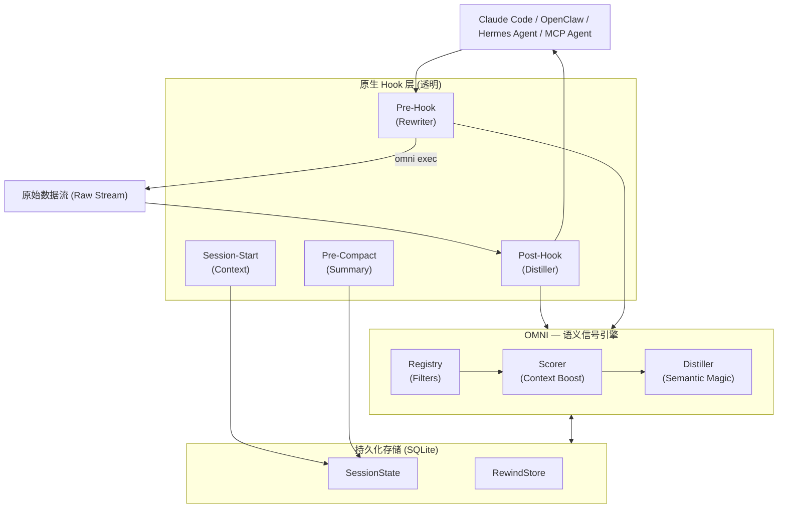

<div align="center">
  
  
  **更少的噪音。更多的信号。将您的AI Token消耗削减高达90%。**

  [🇺🇸 English](../README.md) | [🇯🇵 日本語](README-ja.md) | [🇨🇳 简体中文](README-zh.md) | [🇸🇦 العربية](README-ar.md) | [🇮🇩 Bahasa Indonesia](README-id.md) | [🇻🇳 Tiếng Việt](README-vi.md) | [🇰🇷 한국어](README-ko.md)

  [](https://github.com/fajarhide/omni/actions/workflows/ci.yml)
  [](https://github.com/fajarhide/omni/releases)
  [](https://www.rust-lang.org/)
  [](https://modelcontextprotocol.io/)
  [](https://github.com/fajarhide/omni/blob/main/LICENSE)
  [](https://hits.sh/github.com/fajarhide/omni/)
</div>

<br/>

> **OMNI** 是一个智能终端层，它在命令输出到达您的AI代理之前对其进行智能过滤和优先级排序。通过防止您的AI被嘈杂的输出弄糊涂，您可以更快地获得准确的答案，同时节省大量的Token成本。
> 
> *完全透明。一切尽在您的掌控之中。*
---

## 目录
- [问题：昂贵的Token与嘈杂的输出](#问题昂贵的token与嘈杂的输出)
- [解决方案：Omni](#解决方案omni)
- [设计理念](#设计理念)
- [功能解析](#功能解析)
- [架构](#架构)
- [快速开始与安装](#快速开始与安装)
- [使用方法](#使用方法)
  - [多智能体支持与集成](#多智能体支持与集成)
  - [文档索引](#文档索引)
- [搭配 Heimsense 效果更佳](#搭配-heimsense-效果更佳)
- [贡献与许可证](#贡献与许可证)

---

## 问题：昂贵的Token与嘈杂的输出

当您在终端中使用自主AI代理（例如 Claude Code）时，它们会读取*所有内容*。一个简单的 `git diff`、`npm install` 或 `cargo test` 命令就能轻易将10,000到25,000个Token的无用终端噪音丢入您AI的上下文中。

这导致了三个巨大的问题：
1. **极其昂贵**：您为那些垃圾输出的每一个Token支付了真金白银。
2. **让AI变“笨”**：关键错误被掩埋在数兆字节的警告日志和加载条之下，迷惑了AI并削弱了它的推理能力。
3. **模型锁定**：高级代理框架迫使您使用它们最昂贵的旗舰模型，仅仅是为了拥有一个足够大的上下文窗口来处理所有这些噪音。

## 解决方案：Omni

我构建Omni是因为我想在自己的工作流程中每天高效、廉价地运行AI代理。

**Omni 充当了您的终端和AI之间完美的过滤器。**

**结果呢？** 您可以在超高级框架上运行您的AI代理，并为其提供*零噪音*。因为AI只被提供高度聚焦、直击要害的上下文，即使是平价或普通的模型也能表现得与昂贵的旗舰模型一样出色，因为它们永远不会被垃圾数据分散注意力。

我的终极热情不是为了将其货币化——而是为了智能体AI时代构建终极开源工具带。通过积极地节省Token成本，我今天就可以稳健且高性价比地开发软件，你也可以做到。

---

## 设计理念

OMNI 的诞生不仅仅是为了“削减上下文”或“节省Token”——这些只是令人开心的副作用。OMNI背后的真正理念是 **上下文质量（Context Quality）**。

像Claude这样的AI代理，其聪明程度取决于您提供给它的上下文。当您用以兆字节计的依赖项日志或加载条淹没它们时，您就迫使它们在垃圾中筛选以寻找实际问题。这会稀释它们的推理，并导致回复质量下降或毫无帮助。

**OMNI的目标是向您的AI输入纯净、高密度的信号。** 这意味着只抓取对Claude真正重要和有意义的上下文。我们清理了AI不需要的噪音，这意味着：
1. 自动地，您使用的Token大大减少。
2. AI回复的**质量显著提高**，因为它的上下文窗口像激光一样聚焦于真正的问题。

**尝试一周吧。** 感受一下当您的AI以纯净信号而非原始终端噪音为食时，其推理质量和速度的区别。

---

## 功能解析

- **不再有AI困惑**：Omni 就像一个智能筛子。如果测试失败，它*只*向AI显示具体的错误行和堆栈跟踪。您的AI不再被加载微调器或嘈杂的依赖项日志所干扰，从而使其能够直接专注于实际问题。
- **减少90%的Token**：通过彻底消除无用的终端噪音，您可以在瞬间大幅削减您的代理API账单。
- **零信息丢失**：担心Omni过滤了重要的东西？别担心。Omni将原始输出保存在本地存档（`RewindStore`）中。如果AI确实需要完整的日志，它可以通过使用 `omni_retrieve` 自动请求。
- **会话智能**：Omni 记得您在做什么。它知道您正在主动编辑哪些文件，并停止向AI提供它已经知道的上下文。跨会话内存现在能够通过 `omni_knowledge` 永久保留特定的修复程序。
- **多智能体协作**：Omni通过 `omni_agents` 完全了解其环境。如果您同时运行 Cursor 和 Claude CLI，它们可以无缝共享相同的过滤内存流、活动错误和执行环境而不会发生冲突。
- **提取监视器**：随着时间的推移跟踪您的Token节省情况和成本。直接在您的LLM内部使用 `omni_budget` 和 `omni_history`，或者在本地运行 `omni stats` 以可视化您节省的资金。
- **视觉冲击 (`omni diff`)**：准确查看您节省了多少金钱和空间。只需运行 `omni diff` 即可并排查看笨重的原始输出与Omni时尚的过滤版本的对比。
- **轻量级依赖图**：OMNI在hook时建立快速的本地文件关系图（没有守护进程，没有LSP）。当您的AI读取一个被大量导入的文件时，OMNI会警告它：`"this file has 12 dependents — call omni_context for full impact map."`。
- **自适应压缩**：OMNI跟踪代理何时检索被省略的输出。如果一个命令家族经常被检索，OMNI会在下次自动软化压缩——无需配置即可自我调整。
- **智能高速旁路**：为了确保小型任务的零延迟，OMNI 自动跳过低于 2000 token 阈值的输出的蒸馏。这在优先考虑速度的同时，仍能在关键时刻捕获大数据。
- **省略可见性**：OMNI 现在在输出中明确标记已删除的内容（例如 `[OMNI: omitted X lines of noise]`），让您的 AI 代理更好地了解被过滤掉的内容。
- **调试直通**：需要查看原始输出？只需在环境中设置 `OMNI_PASSTHROUGH=1` 即可完全绕过引擎，查看原始输出的每一个字符。
- **结构化 ReadFile + Grep**：OMNI 不再提供原始文件转储或扁平的 grep 输出，而是返回结构化大纲（导入、公共 API、风险标记）和分组的 grep 摘要（按匹配计数排序的前几名文件，优先显示关键行）。
- **基于事实的反幻觉保护**：OMNI 仅在拥有确凿事实时才发出警告——绝不推测。如果输出被高度压缩且不存在回溯：它会说明。如果一个文件有许多依赖项：它会说明。让您的 AI 立足于现实。

---
## 架构



## 快速开始与安装

Omni 的设置非常简单。它原生集成到您的终端中。

**macOS / Linux:**
```bash
# 1. 通过 Homebrew 安装
brew install fajarhide/tap/omni

# 2. 设置 Omni (用于 Claude, VS Code, OpenCode, Codex, Antigravity 的交互式菜单)
omni init

# 3. 验证它是否正常工作
omni doctor

# 4. 或者自动修复任何问题
omni doctor --fix

# 5. 检查当前状态
omni init --status
```

**通用安装程序 (macOS / Linux / WSL):**
```bash 
curl -fsSL omni.weekndlabs.com/install | bash
```

**Windows (PowerShell):**
```powershell
irm omni.weekndlabs.com/install.ps1 | iex
```

---

## 使用方法

一旦通过 `omni init` 安装，OMNI 就会在后台无形地工作。无论您的AI代理通过MCP运行终端命令，还是您手动管道输出 (`ls | omni`)，OMNI 都会作为透明层自动介入。它智能地过滤终端输出，消除嘈杂的日志，并将清晰的信号交还给AI。

按节省量、命令、周期和路线的详细分类：
```bash
omni stats
```

诊断您的OMNI安装（hooks, MCP, filters, database）：
```bash
omni doctor
```

需要看看过滤器的实际效果或添加您自己的自定义规则吗？
您可以使用 `~/.omni/filters/` 中简单的TOML文件轻松创建自己的规则。

### 多智能体支持与集成

默认情况下，`omni init --claude` 会自动hook进入 **Claude Code**。但是，OMNI通过其内置集成与任何代理AI完美配合！运行 `omni init` 查看交互式菜单。

1. **VS Code & Continue.dev**: 使用我们的 MCP 上下文提供者 (`integrations/continue-dev/`)。
2. **OpenCode & Codex CLI**: 内置包装器自动将命令输出管道到 OMNI。
3. **Antigravity IDE**: OMNI 在 Antigravity 的配置 (`~/.gemini/antigravity/mcp_config.json`) 中注册为本机 MCP 服务器。运行 `omni init --antigravity` 自动设置。

**多智能体调优 (`~/.omni/config.toml`)**
不同的代理有不同的痛点。保持 VS Code 聊天整洁，同时让 OpenCode 读取更多数据。单独调整它们：
```toml
[global]
aggressiveness = "balanced"

[agents.vscode_continue]
aggressiveness = "aggressive"
enable_readfile_distillation = true

[agents.opencode]
aggressiveness = "conservative"
enable_readfile_distillation = false
```

### 文档索引

**致用户：**
- [终极指南 (HOW_TO_USE.md)](../docs/HOW_TO_USE.md) — 您需要的一切：安装，`omni learn`，自定义 TOML 过滤器和 CLI 命令。
- [OpenClaw 集成](https://clawhub.ai/fajarhide/omni-signal-engine) — 用于原生 OMNI 提取的官方 OpenClaw 插件。安装：`openclaw plugins install clawhub:@fajarhide/omni-signal-engine`
- [Hermes Agent 集成](https://github.com/wysie/hermes-omni-plugin) — 社区 Hermes Agent 插件，用于本机 OMNI 提取。安装：`uv pip install --python ~/.hermes/hermes-agent/venv/bin/python git+https://github.com/wysie/hermes-omni-plugin.git`

**致开发者和系统集成商：**
- [开发指南](../docs/DEVELOPMENT.md) — 如何构建和为 OMNI 代码库做贡献。
- [测试架构](../docs/TESTING.md) — 质量保证和上下文安全。
- [会话连续性](../docs/SESSION.md) — 深入了解 OMNI 的工作记忆。
- [路线图](../docs/ROADMAP.md) — 当前开发状态和即将推出的功能。
- [迁移指南](../docs/MIGRATION.md) — 关于从 Node/Zig 升级到 Rust 版本的说明。

---

## 搭配 Heimsense 效果更佳

Omni 是我个人 AI 工具带的一部分。如果您使用 `claude-code`，我强烈建议将 Omni 与我的另一个项目配对使用：**[Heimsense](https://github.com/fajarhide/heimsense)**。

Heimsense 解锁了像 `claude-code` 这样的受限环境，使其可以使用*任何*免费或与 OpenAI 兼容的模型运行，而不是强迫您使用昂贵的 Anthropic 模型。
**Omni + Heimsense** = 零噪音、高精准度，使用平价模型运行世界级的Agent框架。

---

## 贡献与许可证

这是一个为智能体AI时代构建的热情项目。无论您来这里是为了节省Token费用，测试免费模型，还是帮助构建终极智能体工具带，我们都随时欢迎您的贡献！

- **开发**：想要从源码构建？运行 `make ci` 和 `cargo build`。阅读我们的 [CONTRIBUTING.md](../CONTRIBUTING.md) 了解详情。
- **许可证**：[MIT License](../LICENSE)

<!-- Star History -->
<p align="center">
  <a href="https://star-history.com/#fajarhide/omni&Date">
    <picture>
      <source media="(prefers-color-scheme: dark)" srcset="https://api.star-history.com/svg?repos=fajarhide/omni&type=Date&theme=dark" />
      <source media="(prefers-color-scheme: light)" srcset="https://api.star-history.com/svg?repos=fajarhide/omni&type=Date" />
      
    </picture>
  </a>
</p>

由 [Fajar Hidayat](https://github.com/fajarhide) 用 ❤️ 构建
